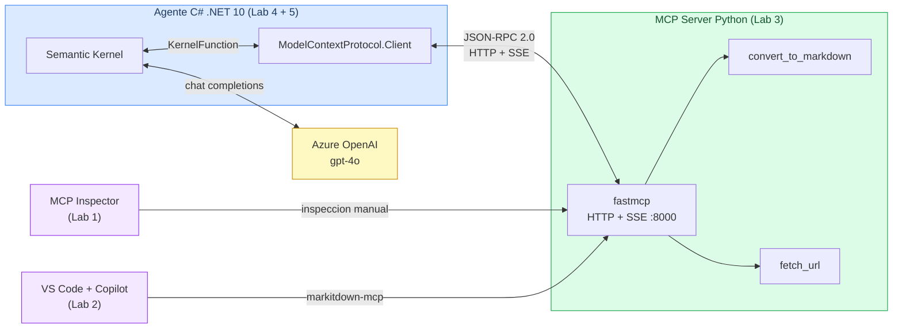

# Formacion GRM: Model Context Protocol (MCP)

Formación de media jornada para el equipo de developers sobre **MCP (Model Context Protocol)**: qué es, cómo usarlo, cómo construir un servidor y cómo integrarlo con nuestros agentes C#.

---

## Agenda

| Hora | Bloque | Material |
|---|---|---|
| 00:00 – 00:15 | Apertura y bienvenida | Este README |
| 00:15 – 00:50 | Fundamentos MCP (35 min) | [mcp-fundamentals/README.md](mcp-fundamentals/README.md) |
| 00:50 – 01:00 | Descanso | |
| 01:00 – 01:20 | Lab 1 — Intro y arquitectura MCP | [labs/01-mcp-intro](workshop/labs/01-mcp-intro/README.md) |
| 01:20 – 01:45 | Lab 2 — Usar markitdown MCP existente | [labs/02-use-existing-mcp](workshop/labs/02-use-existing-mcp/README.md) |
| 01:45 – 02:20 | Lab 3 — Construir un servidor MCP en Python | [labs/03-build-server](workshop/labs/03-build-server/README.md) |
| 02:20 – 02:45 | Lab 4 — Cliente C# con ModelContextProtocol.Client | [labs/04-client-connect](workshop/labs/04-client-connect/README.md) |
| 02:45 – 03:15 | Lab 5 — Azure AI Agents + Semantic Kernel | [labs/05-agent-integration](workshop/labs/05-agent-integration/README.md) |
| 03:15 – 03:30 | Foro abierto + cheatsheet | [cheatsheet.md](workshop/cheatsheet.md) |

---

## Estructura del repositorio

```
formacion-grm-mcp/
├── README.md                      # Este fichero
├── PREREQUISITES.md               # Instalación y verificación del entorno
├── resources.md                   # Links de referencia
├── .github/
│   ├── copilot-instructions.md
│   └── pull_request_template.md
├── mcp-fundamentals/
│   └── README.md                  # Bloque teórico completo
├── sample-server/
│   └── README.md                  # Servidor MCP Python (HTTP+SSE) — Lab 3
├── sample-client/
│   └── README.md                  # Cliente MCP C# .NET 10 — Lab 4
└── workshop/
    ├── README.md
    ├── cheatsheet.md
    ├── trainer-notes.md
    └── labs/
        ├── 01-mcp-intro/
        ├── 02-use-existing-mcp/
        ├── 03-build-server/
        ├── 04-client-connect/
        └── 05-agent-integration/
```

## Arquitectura de la formacion



---

## Guia de inicio rápido

| Paso | Acción |
|---|---|
| 1 | Revisa [PREREQUISITES.md](PREREQUISITES.md) y verifica tu entorno |
| 2 | Lee [mcp-fundamentals/README.md](mcp-fundamentals/README.md) antes de la sesión |
| 3 | Sigue los labs en orden durante el workshop |
| 4 | Usa [cheatsheet.md](workshop/cheatsheet.md) como referencia rápida |
| 5 | Consulta [resources.md](resources.md) para profundizar |

---

## Referencias rápidas

- [Spec oficial MCP](https://spec.modelcontextprotocol.io)
- [microsoft/markitdown](https://github.com/microsoft/markitdown)
- [modelcontextprotocol/servers](https://github.com/modelcontextprotocol/servers)
- [ai-agents-for-beginners cap. 11](https://github.com/microsoft/ai-agents-for-beginners)
- [fastmcp](https://github.com/jlowin/fastmcp)
