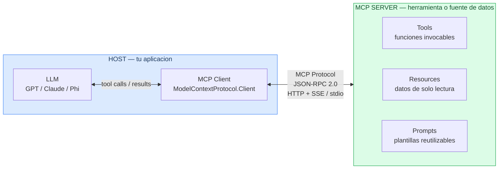
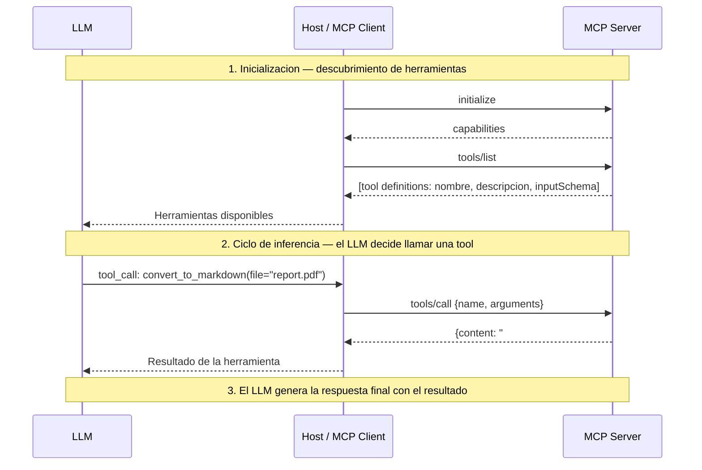
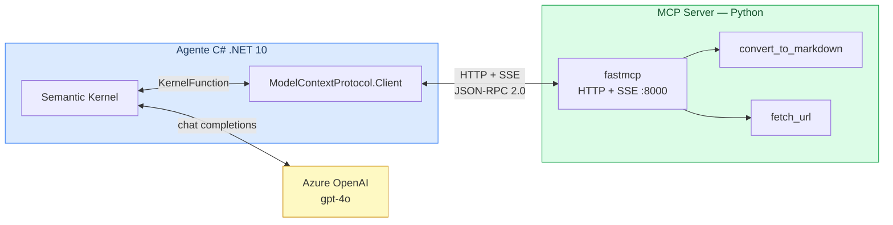

# Fundamentos MCP — Model Context Protocol

## Qué es MCP

**Model Context Protocol (MCP)** es un protocolo abierto, presentado por Anthropic en noviembre de 2024, que estandariza cómo los LLMs se conectan a herramientas y fuentes de datos externas.

Antes de MCP, cada aplicación de IA implementaba su propia integración con cada herramienta: function calling personalizado, formatos distintos, código duplicado. MCP define una interfaz común para que cualquier modelo pueda hablar con cualquier herramienta.

> MCP es a las herramientas de IA lo que USB-C es a los dispositivos: un conector estándar.

---

## Arquitectura: Host / Client / Server



| Componente | Rol |
|---|---|
| **Host** | Aplicación principal (IDE, chatbot, agente). Contiene el cliente MCP y el LLM. |
| **MCP Client** | Mantiene la conexión con un servidor MCP. Envía requests y recibe respuestas. |
| **MCP Server** | Expone capacidades (tools, resources, prompts) a través del protocolo. |
| **LLM** | Decide cuándo y qué tool llamar, usando las descripciones que el servidor expone. |

---

## Primitivas del protocolo

### Tools

Funciones que el LLM puede invocar. Son el equivalente a _function calling_ pero estándar.

```json
{
  "name": "convert_to_markdown",
  "description": "Converts a document to Markdown format",
  "inputSchema": {
    "type": "object",
    "properties": {
      "file_path": { "type": "string" }
    },
    "required": ["file_path"]
  }
}
```

### Resources

Datos que el servidor expone para que el LLM los lea. Son de **solo lectura**, se identifican por URI y el cliente los obtiene bajo demanda — el LLM nunca los recibe enteros salvo que los pida explícitamente.

Dos sabores:

| Tipo | Descripción | Ejemplo de URI |
|---|---|---|
| **Estático** | Contenido fijo; siempre devuelve lo mismo | `file:///docs/api-spec.md` |
| **Dinámico** | Calculado en el momento de la lectura | `db://customers/42`, `https://api.example.com/orders` |

```json
// resources/list — el servidor anuncia qué expone
{
  "resources": [
    {
      "uri": "db://customers/42",
      "name": "Customer #42",
      "description": "Profile and order history for customer 42",
      "mimeType": "application/json"
    }
  ]
}

// resources/read — el cliente (o el LLM) pide el contenido
{ "method": "resources/read", "params": { "uri": "db://customers/42" } }

// respuesta
{ "contents": [{ "uri": "db://customers/42", "text": "{ \"name\": \"Acme\", ... }" }] }
```

> **Cuándo usarlos**: cuando el dato es grande o cambia con frecuencia y no quieres meterlo en el system prompt. El LLM pide solo lo que necesita.

### Prompts

Plantillas de mensajes parametrizadas que el servidor ofrece como **atajos reutilizables**. Piénsalos como slash-commands con argumentos: el servidor define `/resumir`, `/traducir`, etc. y el cliente o el usuario los invoca por nombre.

```json
// prompts/list — catálogo de plantillas disponibles
{
  "prompts": [
    {
      "name": "summarize_document",
      "description": "Summarize a document in the requested language",
      "arguments": [
        { "name": "uri",      "description": "Document URI",     "required": true  },
        { "name": "language", "description": "Target language",  "required": false }
      ]
    }
  ]
}

// prompts/get — el cliente resuelve la plantilla con argumentos concretos
{
  "method": "prompts/get",
  "params": { "name": "summarize_document", "arguments": { "uri": "file:///report.pdf", "language": "Spanish" } }
}

// respuesta: mensajes listos para inyectar en el contexto del LLM
{
  "messages": [
    { "role": "user", "content": { "type": "text", "text": "Summarize the following document in Spanish:\n\n# Q1 Report..." } }
  ]
}
```

> **Cuándo usarlos**: instrucciones complejas que se repiten mucho, onboarding de usuarios con flujos guiados, o cuando quieres que el servidor (no el cliente) controle el wording exacto del prompt.

---

## Transports

MCP es independiente del transporte. Los dos principales son:

| Transport | Descripción | Cuándo usarlo |
|---|---|---|
| **stdio** | El cliente lanza el servidor como subproceso y se comunica por stdin/stdout | Local, herramientas CLI, VS Code extensions |
| **HTTP + SSE** | El servidor es un servicio HTTP. El cliente envía requests POST y recibe eventos SSE | Servicios remotos, microservicios, clientes .NET/Java |

En esta formación usamos **HTTP+SSE** en el servidor Python porque nuestro cliente C# (MAF) se conecta a servidores remotos via SSE.

---

## Flujo de una llamada MCP




El protocolo de mensajería es **JSON-RPC 2.0** sobre el transport elegido.

---

## Los mensajes en el cable

Cada mensaje MCP es un objeto JSON-RPC 2.0 con esta estructura base:

```json
{
  "jsonrpc": "2.0",
  "id": 1,
  "method": "...",
  "params": { ... }
}
```

A continuación, los 4 intercambios que ocurren en cada conexión.

### 1. initialize

El cliente anuncia su versión del protocolo y sus capacidades. El servidor responde con las suyas.

**Request (cliente → servidor):**
```json
{
  "jsonrpc": "2.0",
  "id": 1,
  "method": "initialize",
  "params": {
    "protocolVersion": "2024-11-05",
    "capabilities": {
      "roots": { "listChanged": true },
      "sampling": {}
    },
    "clientInfo": {
      "name": "ModelContextProtocol.Client",
      "version": "1.0.0"
    }
  }
}
```

**Response (servidor → cliente):**
```json
{
  "jsonrpc": "2.0",
  "id": 1,
  "result": {
    "protocolVersion": "2024-11-05",
    "capabilities": {
      "tools": { "listChanged": true },
      "resources": {}
    },
    "serverInfo": {
      "name": "grm-tools",
      "version": "1.0.0"
    }
  }
}
```

### 2. notifications/initialized

El cliente confirma que la inicialización ha completado. Es una notificación (no tiene `id`, no espera respuesta).

```json
{
  "jsonrpc": "2.0",
  "method": "notifications/initialized"
}
```

### 3. tools/list

El cliente pide el catálogo de herramientas disponibles.

**Request:**
```json
{
  "jsonrpc": "2.0",
  "id": 2,
  "method": "tools/list",
  "params": {}
}
```

**Response:**
```json
{
  "jsonrpc": "2.0",
  "id": 2,
  "result": {
    "tools": [
      {
        "name": "echo",
        "description": "Returns the same message back.",
        "inputSchema": {
          "type": "object",
          "properties": {
            "message": { "type": "string" }
          },
          "required": ["message"]
        }
      }
    ]
  }
}
```

El cliente pasa este catálogo al LLM. El LLM lo usa para decidir qué tool invocar y con qué argumentos.

### 4. tools/call

El LLM ha decidido llamar una tool. El cliente envía el nombre y los argumentos al servidor.

**Request:**
```json
{
  "jsonrpc": "2.0",
  "id": 3,
  "method": "tools/call",
  "params": {
    "name": "echo",
    "arguments": {
      "message": "hola desde el inspector"
    }
  }
}
```

**Response:**
```json
{
  "jsonrpc": "2.0",
  "id": 3,
  "result": {
    "content": [
      {
        "type": "text",
        "text": "Echo: hola desde el inspector"
      }
    ],
    "isError": false
  }
}
```

Si la tool lanza una excepción, `isError` es `true` y `content[0].text` contiene el mensaje de error. El LLM recibe ese resultado y decide si reintentar o informar al usuario.

> Para la spec completa: [modelcontextprotocol.io/specification](https://modelcontextprotocol.io/specification/2024-11-05)

---

## MCP vs Function Calling clásico

| Aspecto | Function Calling clásico | MCP |
|---|---|---|
| Definición de tools | En el código de la app | En el servidor MCP (descubrimiento dinámico) |
| Reutilización | Cada app re-implementa | Un servidor sirve a múltiples clientes |
| Transporte | API del proveedor de LLM | Estándar abierto (stdio / HTTP+SSE) |
| Ecosistema | Específico del modelo | Agnóstico al modelo |
| Autenticación | Ad-hoc | Definida en el protocolo (Bearer / OAuth) |

---

## ¿Puedo fiarme de un servidor MCP de terceros?

Un servidor MCP no es solo una librería: **es código que se ejecuta activamente** en tu entorno o en el de tu usuario. Antes de usar uno que no hayas escrito tú, vale la pena entender el riesgo.

### El modelo de amenaza depende del transporte

| Transporte | Dónde corre el servidor | Riesgo |
|---|---|---|
| **stdio** | En la máquina local del usuario, con sus credenciales | Alto: código local con acceso total al proceso |
| **HTTP remoto** | En un servidor externo | Medio: similar a usar cualquier API de terceros |

Con **stdio**, instalar un servidor MCP malicioso es equivalente a ejecutar un binario desconocido: tiene acceso a tu sistema de ficheros, variables de entorno, tokens, etc.

### Qué mirar antes de usar un servidor MCP externo

```
[ ] ¿El código fuente es público y revisable?
[ ] ¿El namespace/organización es oficial y reconocible?
[ ] ¿Tiene historial de commits activo y mantenedores identificables?
[ ] ¿Las herramientas que expone justifican los permisos que necesita?
[ ] ¿Tiene más de unos pocos cientos de descargas o estrellas?
[ ] ¿El paquete npm coincide con el repo GitHub que dice ser?
```

### Servidor propio vs paquete de tercero

| | Servidor propio | Paquete npm de tercero |
|---|---|---|
| **Confianza** | Total — tú controlas el código | Depende: hay que evaluarlo como cualquier dependencia |
| **Auditoría** | Trivial | Requiere revisar el fuente y el historial |
| **Mantenimiento** | A tu cargo | Depende del autor |
| **Recomendado para producción** | Sí | Solo si el origen es verificable |

### Regla práctica

> Un servidor MCP **stdio** que instalas con `npx` o `npm install -g` tiene los mismos permisos que tú en tu terminal. Trátalo como si fuera un ejecutable, no como si fuera una página web.

Para producción en GRM: construir nuestros propios servidores MCP (como hacemos en el Lab 3) es la opción más segura y la que nos da control total sobre qué herramientas se exponen y con qué permisos.

## Stack completo de la formacion




---

## Lecturas previas recomendadas

Antes del workshop, lee al menos:

1. [MCP Introduction](https://modelcontextprotocol.io/introduction) (5 min)
2. [Core Architecture](https://modelcontextprotocol.io/docs/concepts/architecture) (10 min)
3. Capítulo 11 de [ai-agents-for-beginners](https://github.com/microsoft/ai-agents-for-beginners) (lectura ligera)
