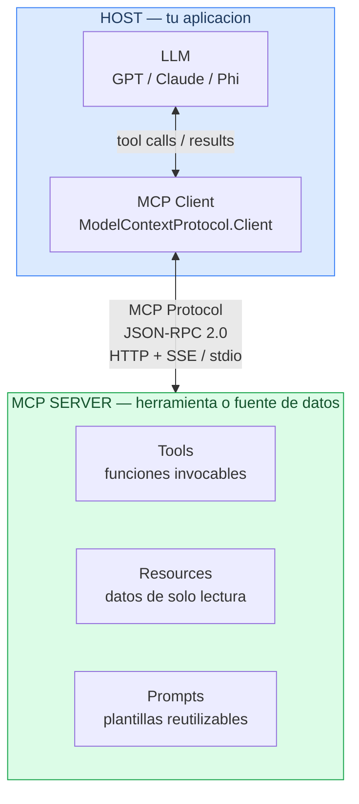
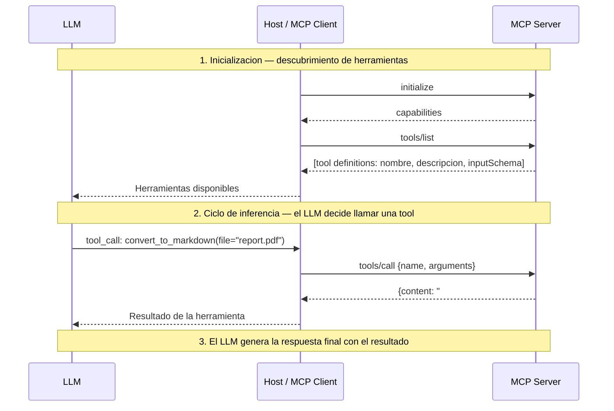
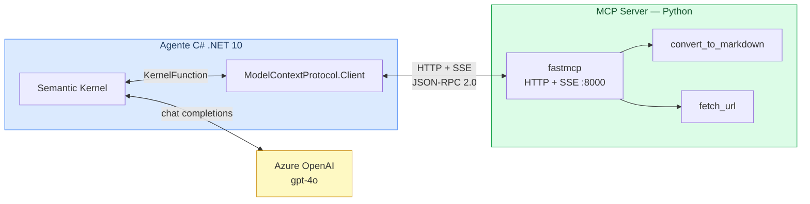

# Fundamentos MCP — Model Context Protocol

## Qué es MCP

**Model Context Protocol (MCP)** es un protocolo abierto, presentado por Anthropic en noviembre de 2024, que estandariza cómo los LLMs se conectan a herramientas y fuentes de datos externas.

Antes de MCP, cada aplicación de IA implementaba su propia integración con cada herramienta: function calling personalizado, formatos distintos, código duplicado. MCP define una interfaz común para que cualquier modelo pueda hablar con cualquier herramienta.

> MCP es a las herramientas de IA lo que USB-C es a los dispositivos: un conector estándar.

---

## Arquitectura: Host / Client / Server



| Componente | Rol |
|---|---|
| **Host** | Aplicación principal (IDE, chatbot, agente). Contiene el cliente MCP y el LLM. |
| **MCP Client** | Mantiene la conexión con un servidor MCP. Envía requests y recibe respuestas. |
| **MCP Server** | Expone capacidades (tools, resources, prompts) a través del protocolo. |
| **LLM** | Decide cuándo y qué tool llamar, usando las descripciones que el servidor expone. |

---

## Primitivas del protocolo

### Tools

Funciones que el LLM puede invocar. Son el equivalente a _function calling_ pero estándar.

```json
{
  "name": "convert_to_markdown",
  "description": "Converts a document to Markdown format",
  "inputSchema": {
    "type": "object",
    "properties": {
      "file_path": { "type": "string" }
    },
    "required": ["file_path"]
  }
}
```

### Resources

Datos que el servidor expone para que el LLM los lea (ficheros, registros, páginas web...). Son de solo lectura y se identifican por URI.

```
https://modelcontextprotocol.io/introduction
db://customers/42
https://api.example.com/products
```

### Prompts

Plantillas de mensajes parametrizadas que el servidor ofrece como shortcuts reutilizables.

---

## Transports

MCP es independiente del transporte. Los dos principales son:

| Transport | Descripción | Cuándo usarlo |
|---|---|---|
| **stdio** | El cliente lanza el servidor como subproceso y se comunica por stdin/stdout | Local, herramientas CLI, VS Code extensions |
| **HTTP + SSE** | El servidor es un servicio HTTP. El cliente envía requests POST y recibe eventos SSE | Servicios remotos, microservicios, clientes .NET/Java |

En esta formación usamos **HTTP+SSE** en el servidor Python porque nuestro cliente C# (MAF) se conecta a servidores remotos via SSE.

---

## Flujo de una llamada MCP




El protocolo de mensajería es **JSON-RPC 2.0** sobre el transport elegido.

---

## MCP vs Function Calling clásico

| Aspecto | Function Calling clásico | MCP |
|---|---|---|
| Definición de tools | En el código de la app | En el servidor MCP (descubrimiento dinámico) |
| Reutilización | Cada app re-implementa | Un servidor sirve a múltiples clientes |
| Transporte | API del proveedor de LLM | Estándar abierto (stdio / HTTP+SSE) |
| Ecosistema | Específico del modelo | Agnóstico al modelo |
| Autenticación | Ad-hoc | Definida en el protocolo (Bearer / OAuth) |

## Stack completo de la formacion




---

## Lecturas previas recomendadas

Antes del workshop, lee al menos:

1. [MCP Introduction](https://modelcontextprotocol.io/introduction) (5 min)
2. [Core Architecture](https://modelcontextprotocol.io/docs/concepts/architecture) (10 min)
3. Capítulo 11 de [ai-agents-for-beginners](https://github.com/microsoft/ai-agents-for-beginners) (lectura ligera)
