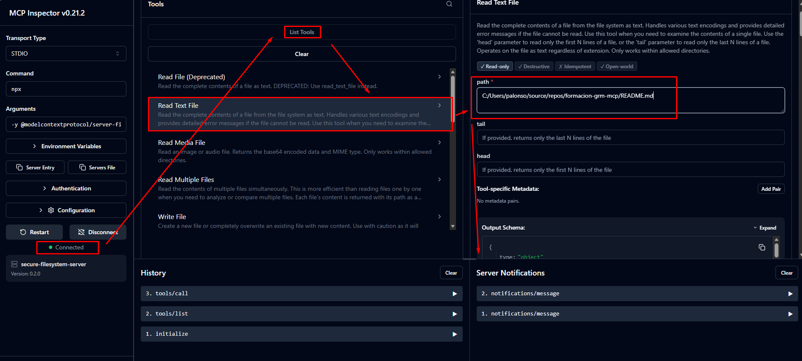
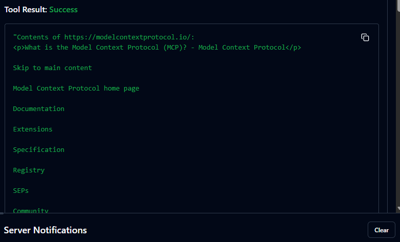
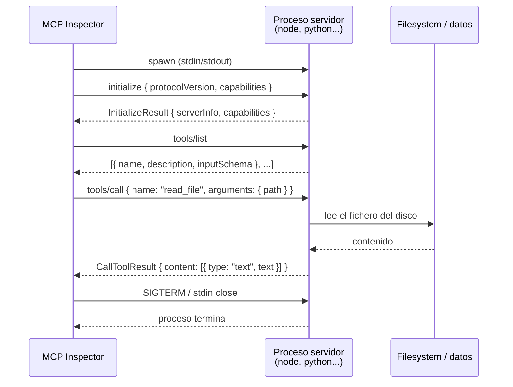

# Lab 1 — Intro y arquitectura MCP

**Duración**: 20 min  
**Objetivo**: Entender la arquitectura MCP (Host / Client / Server), las primitivas del protocolo y explorar un servidor MCP existente con MCP Inspector.

---

## Prerrequisitos

- MCP Inspector instalado: `npm install -g @modelcontextprotocol/inspector`
- Acceso a internet para descargar `@modelcontextprotocol/server-filesystem`

> [!NOTE]
> **¿Qué significa `npx -y`?**
>
> `npx` ejecuta un paquete de npm sin necesidad de instalarlo globalmente. Si el paquete no está en caché local, lo descarga en el momento.
>
> El flag `-y` (equivalente a `--yes`) responde automáticamente "sí" a cualquier confirmación de instalación, evitando que el comando se quede esperando input interactivo. En estos labs lo usamos para que los servidores MCP arranquen sin interrupciones.

---

## Qué es MCP Inspector

**MCP Inspector** es una herramienta de desarrollo web que permite conectarse a cualquier servidor MCP, explorar sus capacidades e invocar sus tools manualmente — sin escribir código.

Es el equivalente a Postman o Swagger UI pero para el protocolo MCP. Resulta imprescindible para:

- Verificar que un servidor arranca y responde correctamente
- Explorar qué tools, resources y prompts expone
- Depurar los mensajes JSON-RPC 2.0 que se intercambian
- Probar argumentos de tools antes de integrarlos en un cliente

En producción no se usa, pero durante el desarrollo es la forma más rápida de validar que un servidor MCP funciona antes de conectarle un cliente C# o un agente.

---

## Pasos

### 1. Revisar el diagrama de arquitectura

Lee [mcp-fundamentals/README.md](../../../mcp-fundamentals/README.md) y asegúrate de entender:

- El papel de **Host**, **Client** y **Server**
- Las tres primitivas: **Tools**, **Resources**, **Prompts**
- La diferencia entre transporte **stdio** y **HTTP+SSE**

### 2. Arrancar MCP Inspector con el servidor filesystem

Vamos a inspeccionar el servidor MCP de `filesystem` (oficial de Anthropic).

> El servidor solo tiene acceso a las carpetas que le indiques al arrancarlo. Puedes pasar más de una.

Arranca el inspector apuntando a las carpetas que quieras explorar:

```powershell
mcp-inspector npx -y @modelcontextprotocol/server-filesystem "C:/Users/$env:USERNAME/Documents" "C:/Users/$env:USERNAME/source/repos/formacion-grm-mcp"
```

Se abrirá el Inspector en `http://localhost:6274`.

### 3. Conectar al servidor

En el panel izquierdo del Inspector:

1. **Transport Type**: `STDIO` (el servidor filesystem usa stdio, no HTTP)
2. **Command**: `npx`
3. **Arguments**: `-y @modelcontextprotocol/server-filesystem C:/Users/TU_USUARIO/source/repos/formacion-grm-mcp`
4. Haz clic en **Connect**
5. El indicador verde **Connected** confirma la conexión

### 4. Listar las tools disponibles

1. Ve a la pestaña **Tools** (panel central)
2. Haz clic en **List Tools**
3. Aparecerá la lista de tools que expone el servidor: `read_file`, `read_text_file`, `list_directory`, `write_file`, etc.

### 5. Usar Read Text File



1. Haz clic sobre **Read Text File** en la lista de tools
2. En el panel derecho aparece el formulario de argumentos
3. En el campo **path** (obligatorio, marcado con `*`) introduce la ruta con barras normales `/`:

```
C:/Users/TU_USUARIO/source/repos/formacion-grm-mcp/README.md
```

4. Haz clic en **Run Tool**
5. El resultado aparece debajo: el contenido del fichero en texto plano

> **Windows**: usa siempre `/` en los paths, nunca `\`. Node.js los acepta igual.

> El servidor solo puede leer ficheros dentro de las carpetas que le pasaste al arrancarlo. Si el fichero está fuera, obtendrás un error `ENOENT` o `Access denied`.

### 6. Observar los mensajes JSON-RPC

En la sección **History** (parte inferior del panel central) puedes ver los mensajes en orden:

1. `initialize` — handshake inicial con las capacidades del servidor
2. `tools/list` — petición y respuesta con el schema de cada tool
3. `tools/call` — llamada a la tool con los argumentos y la respuesta con el resultado

Abre cada uno para ver el JSON-RPC 2.0 raw. Esto es exactamente lo que el cliente C# enviará en el Lab 4.

---

## Las tres primitivas MCP con server-everything

`server-everything` es el servidor de demostración oficial. Expone todas las primitivas a la vez (Tools, Resources y Prompts) y es ideal para entender qué hace cada una antes de construir la tuya propia.

Arráncalo en el Inspector con:

En **Command**: `npx`  
En **Arguments**: `-y @modelcontextprotocol/server-everything`

Haz clic en **Connect**.

---

### Tools — acciones que el LLM puede invocar

Una **Tool** tiene un nombre, un schema de argumentos y devuelve un resultado. El LLM decide cuándo llamarla según el contexto de la conversación.

`server-everything` expone estas tools. Pruébalas en la pestaña **Tools**:

| Tool | Qué hace | Argumentos de ejemplo |
|---|---|---|
| `echo` | Devuelve el mensaje tal cual | `message: "hola mundo"` |
| `add` | Suma dos números | `a: 3`, `b: 7` → devuelve `10` |
| `longRunningOperation` | Simula una operación larga con notificaciones de progreso | `duration: 5`, `steps: 3` |
| `getTinyImage` | Devuelve una imagen PNG en base64 | (sin argumentos) |
| `printEnv` | Devuelve las variables de entorno del proceso servidor | (sin argumentos) |

> **Prueba `longRunningOperation`**: verás cómo el servidor envía mensajes de progreso intermedios antes del resultado final. Así es como un agente puede informar al usuario de que está trabajando.

---

### Resources — contenido que el servidor expone

Un **Resource** es una URI que el cliente puede leer para obtener datos. No es una acción: es contenido. El LLM puede recibirlo como contexto adicional sin "ejecutar" nada.

Ve a la pestaña **Resources** y haz clic en **List Resources**. Verás URIs del tipo:

```
test://static/resource/1
test://static/resource/2
...
```

Haz clic en cualquiera y pulsa **Read Resource**. El servidor devuelve el contenido de ese recurso (texto plano en este caso).

> **Diferencia clave con Tools**: el cliente decide cuándo leer un Resource (normalmente para inyectarlo en el contexto del LLM). Con una Tool es el LLM quien decide cuándo invocarla.

---

### Prompts — plantillas reutilizables

Un **Prompt** es una plantilla de mensaje predefinida en el servidor que el cliente puede solicitar. Permite que el servidor defina cómo debe el LLM abordar una tarea concreta, sin que esa lógica viva en el cliente.

Ve a la pestaña **Prompts** y haz clic en **List Prompts**. Verás:

| Prompt | Descripción | Argumentos |
|---|---|---|
| `simple_prompt` | Plantilla sin argumentos | — |
| `complex_prompt` | Plantilla parametrizable | `temperature: "creative"`, `style: "formal"` |

Selecciona `complex_prompt`, rellena los argumentos y haz clic en **Get Prompt**. El servidor devuelve los mensajes ya formateados listos para enviarse al LLM.

> **Caso de uso real**: el servidor de una empresa puede exponer un prompt `redactar_oferta` con su tono corporativo y campos variables. El agente solo lo pide y lo ejecuta — sin hardcodear el texto en el cliente.

---

## Preguntas de reflexión

> [!NOTE]
> Intenta responder antes de desplegar. Son conceptos clave que aparecen en todos los labs siguientes.

---

**1. ¿Qué diferencia hay entre una Tool y un Resource?**

<details>
<summary>Mostrar respuesta</summary>

> **Tool = verbo. Resource = sustantivo.**

Una **Tool** es una acción que el LLM invoca para hacer algo: leer un fichero, llamar a una API, ejecutar código. Tiene argumentos de entrada y devuelve un resultado.

Un **Resource** es contenido estático o semi-estático que el servidor expone para que el cliente lo lea directamente, sin que el LLM lo "ejecute" (un documento, un esquema, el estado de una base de datos). El LLM puede incluirlo en su contexto pero no lo invoca como función.

</details>

---

**2. ¿Por qué el servidor `filesystem` usa transporte stdio y no SSE?**

<details>
<summary>Mostrar respuesta</summary>

> Porque es un proceso local, no un servicio de red.

El servidor filesystem se ejecuta como proceso hijo del host. El transporte `stdio` es lo más sencillo: el host arranca el proceso y se comunica con él a través de stdin/stdout, sin abrir puertos ni gestionar conexiones HTTP.

**SSE** (HTTP + Server-Sent Events) se usa cuando el servidor MCP es un servicio remoto al que varios clientes se conectan simultáneamente.

</details>

---

**3. ¿Qué ventaja tiene MCP frente a implementar function calling directamente en el LLM?**

<details>
<summary>Mostrar respuesta</summary>

> Con function calling nativo cada integración es ad-hoc y queda acoplada a un modelo concreto.

MCP estandariza la capa de herramientas con un protocolo único (JSON-RPC 2.0):

- El mismo servidor funciona con cualquier cliente compatible (Claude, GPT, Semantic Kernel...)
- Reutilizas servidores de terceros sin tocar tu código de agente
- El servidor puede evolucionar o desplegarse de forma independiente
- La seguridad y el control de acceso se gestionan en el servidor, no en el prompt

</details>

---

## Otros servidores para probar con el Inspector

Todos usan transporte `STDIO`. Sustituye `TU_USUARIO` por tu nombre de usuario de Windows.

**Git** — expone el historial, diffs y ramas de un repositorio local (paquete npm):

```powershell
npx -y @modelcontextprotocol/server-git --repository "C:/Users/TU_USUARIO/source/repos/formacion-grm-mcp"
```

**Fetch** — descarga y convierte URLs a texto/markdown (paquete **Python**, no npm).

Instala el paquete:

```powershell
pip install mcp-server-fetch
```

Arranca el Inspector apuntando al servidor:

```powershell
npx @modelcontextprotocol/inspector python -m mcp_server_fetch
```

Conéctate y ve a la pestaña **Tools**. Verás la tool `fetch`. Llámala con:

```json
{ "url": "https://modelcontextprotocol.io/" }
```

El servidor descarga la página y la convierte a texto plano, listo para que un LLM lo procese.



> **Certificados SSL en red corporativa**
>
> Si tu empresa usa un proxy con inspección SSL (p.ej. Netskope, Zscaler), Python rechazará la conexión con error `CERTIFICATE_VERIFY_FAILED`. La causa es que `mcp-server-fetch` usa `httpx`, que valida contra el bundle de `certifi` — no contra el store de Windows.
>
> Una solución es añadir el certificado raíz corporativo al bundle de `certifi`:
>
> ```powershell
> # 1. Exportar el cert desde el store de Windows (busca el thumbprint de tu CA)
> $cert = Get-ChildItem Cert:\LocalMachine\Root | Where-Object { $_.Subject -like "*netskope*" }
> $pem = "-----BEGIN CERTIFICATE-----`n" + [Convert]::ToBase64String($cert.Export("Cert"), "InsertLineBreaks") + "`n-----END CERTIFICATE-----`n"
> $pem | Out-File "$env:TEMP\corp-ca.pem" -Encoding ascii
>
> # 2. Añadirlo al bundle de certifi
> $certifiPath = python -c "import certifi; print(certifi.where())"
> Add-Content -Path $certifiPath -Value (Get-Content "$env:TEMP\corp-ca.pem" -Raw)
> ```
>
> Esto modifica el bundle de `certifi`. Si actualizas el paquete, tendrás que repetirlo. Hazlo bajo tu propia responsabilidad y con conocimiento de lo que implica (el proxy podrá inspeccionar el tráfico HTTPS de Python, igual que ya hace con el resto del SO).

> Todos estos servidores son oficiales y están en [github.com/modelcontextprotocol/servers](https://github.com/modelcontextprotocol/servers).

---

## Qué ha pasado por debajo

Cuando conectas MCP Inspector a un servidor stdio, el flujo completo es:



El transporte **stdio** implica que el servidor no abre ningún puerto. Se comunica exclusivamente por stdin (mensajes entrantes) y stdout (respuestas). Por eso el servidor solo puede tener **un cliente a la vez**: el proceso que lo arrancó.

En el **Lab 3** verás que con `transport="sse"` el servidor abre un endpoint HTTP real, permitiendo que múltiples clientes se conecten simultáneamente — incluyendo un cliente C# desde otra máquina.

---

## Siguiente paso

[Lab 2 — Usar markitdown MCP existente](../02-use-existing-mcp/README.md)

---

## Referencias

- [MCP Inspector — documentacion oficial](https://modelcontextprotocol.io/docs/tools/inspector)
- [Especificacion del protocolo MCP](https://modelcontextprotocol.io/docs/concepts/architecture)
- [Servidor MCP Filesystem (npm)](https://www.npmjs.com/package/@modelcontextprotocol/server-filesystem)
- [SDK MCP — repositorio oficial](https://github.com/modelcontextprotocol/modelcontextprotocol)
