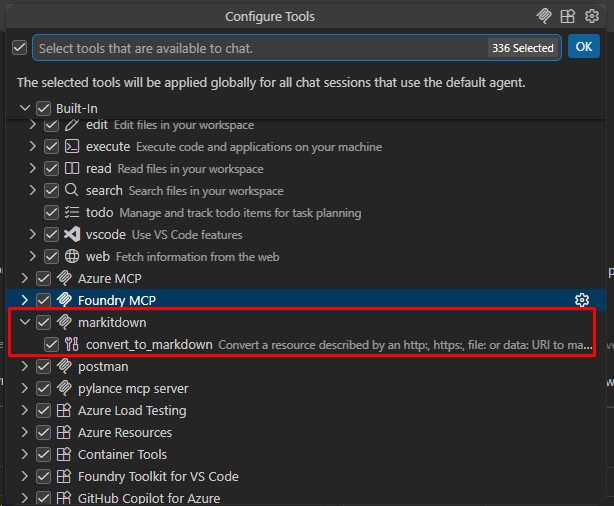
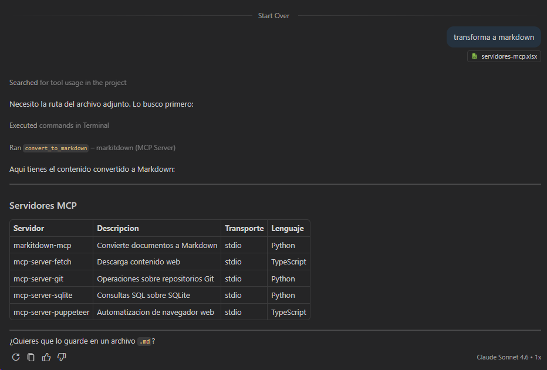

# Lab 2 — Usar markitdown MCP existente

**Duración**: 25 min  
**Objetivo**: Instalar y configurar `microsoft/markitdown` como servidor MCP en VS Code y usarlo desde GitHub Copilot Chat para convertir documentos.

---

## Prerrequisitos

- VS Code con GitHub Copilot habilitado
- Python 3.11+ y uv instalados
- `uv` o `uvx` disponible en PATH

> **¿Qué es `uv`?**
>
> `uv` es un gestor de paquetes y entornos Python escrito en Rust, creado por Astral. Es entre 10x y 100x más rápido que `pip` e incluye resolución de dependencias, gestión de versiones de Python y manejo de entornos virtuales en una sola herramienta.
>
> Los subcomandos clave que usaremos:
> - `uv tool install <paquete>` — instala una herramienta CLI de Python de forma aislada (equivalente a `pipx install`). El ejecutable queda disponible en PATH.
> - `uvx <paquete> [args]` — ejecuta una herramienta sin instalarla previamente (equivalente a `npx` para Node.js). Descarga, ejecuta y descarta el entorno temporal.
>
> Cuando ves `uvx markitdown-mcp` en una configuración MCP, VS Code (o cualquier host) lanza la herramienta bajo demanda sin necesidad de instalación global previa.

---

## Pasos

### 1. Instalar markitdown MCP

markitdown ofrece un servidor MCP que permite a cualquier LLM convertir documentos (PDF, Word, Excel, HTML, imágenes...) a Markdown.

```powershell
# Instalar con uv (recomendado)
uv tool install markitdown-mcp

# Verificar que está instalado
uv tool list
```

> **Red corporativa con proxy SSL (Netskope, Zscaler...)**
>
> Si la instalación falla con un error de certificado, usa el flag `--native-tls` para que `uv` use el almacén de certificados de Windows en lugar de su propio bundle:
>
> ```powershell
> uv tool install markitdown-mcp --native-tls
> ```

> **Nota**: `markitdown-mcp` no soporta el flag `--version`. Para comprobar la versión instalada usa `uv tool list`.

### 2. Configurar el servidor en VS Code

VS Code permite definir servidores MCP en **dos ámbitos**:

| Ámbito | Ubicación | Cuándo usarlo |
|---|---|---|
| **Global** (todos los workspaces) | `%APPDATA%\Code\User\mcp.json` | Herramientas que usas siempre (markitdown, postman…) |
| **Workspace** (solo ese proyecto) | `.vscode/mcp.json` en la raíz del proyecto | Herramientas específicas del proyecto, versionables con el repo |

#### Opción A — Config global (recomendada para este lab)

Edita `%APPDATA%\Code\User\mcp.json` (créalo si no existe):

```json
{
  "servers": {
    "markitdown": {
      "command": "uvx",
      "args": ["markitdown-mcp"]
    }
  }
}
```

Si ya tienes otros servidores definidos (por ejemplo Postman), añade `markitdown` junto a ellos:

```json
{
  "servers": {
    "markitdown": {
      "command": "uvx",
      "args": ["markitdown-mcp"]
    },
    "postman": {
      "type": "http",
      "url": "https://mcp.postman.com/mcp"
    }
  }
}
```

#### Opción B — Config de workspace

Crea `.vscode/mcp.json` en la raíz del proyecto con el mismo contenido. Esta opción es útil si quieres versionar la configuración MCP junto al código.

Reinicia VS Code o recarga la configuración MCP (Command Palette: `MCP: Restart Servers`).

### 3. Verificar que el servidor está activo

En VS Code, abre Copilot Chat y comprueba que aparece el icono de herramientas. Puedes listar las tools disponibles escribiendo:

```
@workspace ¿Qué tools tienes disponibles?
```

Para confirmar que `markitdown` está registrado, abre el panel **Configure Tools** (icono de herramienta en Copilot Chat). Deberías ver el servidor y su tool `convert_to_markdown`:



### 4. Convertir un documento

#### Desde una URL

Prueba con la especificación oficial de MCP:

```
Convierte https://spec.modelcontextprotocol.io/specification/ a Markdown y resume los conceptos clave
```

o con la introducción del protocolo:

```
Lee https://modelcontextprotocol.io/introduction y conviértelo a Markdown resumido
```

#### Desde archivos locales

En este lab hay archivos de prueba en `sample-files/` para que compruebes el comportamiento con distintos formatos:

| Archivo | Formato | Qué prueba |
|---|---|---|
| `servidores-mcp.xlsx` | Excel | Tablas → Markdown |
| `arquitectura-mcp.png` | Imagen | OCR / descripción visual |

Arrastra los archivos a Copilot Chat o pásalos por ruta:

```
Convierte el archivo sample-files/servidores-mcp.xlsx a Markdown
```

```
Describe y convierte a Markdown la imagen sample-files/arquitectura-mcp.png
```

Aquí puedes ver cómo Copilot usa la tool `convert_to_markdown` del servidor markitdown para transformar el Excel a una tabla Markdown:



### 5. Usar markitdown desde GitHub Copilot CLI

Si tienes GitHub Copilot CLI instalado, puedes configurar el mismo servidor MCP para usarlo desde la terminal.

**Configuración en Copilot CLI** — añade `markitdown` al fichero de servidores MCP del CLI. La ubicación habitual en Windows es `%APPDATA%\GitHub Copilot\mcp.json` (o el fichero de configuración que indique tu versión):

```json
{
  "servers": {
    "markitdown": {
      "command": "uvx",
      "args": ["markitdown-mcp"]
    }
  }
}
```

Una vez configurado, puedes pedirle al CLI que use la herramienta:

```
gh copilot suggest "convierte sample-files/servidores-mcp.xlsx a markdown"
```

O en modo chat interactivo (`gh copilot chat`):

```
Usa markitdown para convertir este Excel a Markdown: sample-files/servidores-mcp.xlsx
```

> **Uso directo sin MCP**: markitdown también tiene una interfaz CLI. Si solo necesitas la conversión sin pasar por el protocolo MCP, puedes ejecutarlo directamente:
>
> ```powershell
> uvx markitdown sample-files/servidores-mcp.xlsx
> uvx markitdown sample-files/arquitectura-mcp.png
> uvx markitdown https://spec.modelcontextprotocol.io/specification/
> ```

### 6. Explorar otro servidor MCP (opcional)

Navega a [modelcontextprotocol/servers](https://github.com/modelcontextprotocol/servers) y elige otro servidor que te parezca útil (git, fetch, puppeteer...).

Instálalo y conéctalo de la misma forma.

---

## Qué ha pasado por debajo

Cuando Copilot usó markitdown:

1. VS Code (Host) lanzó `uvx markitdown-mcp` como subproceso (transporte **stdio**)
2. El Host envió `tools/list` para descubrir las tools
3. Copilot (LLM) recibió las definiciones de tools y decidió llamar a `convert`
4. El Host envió `tools/call` con los argumentos al servidor
5. El resultado (Markdown) llegó de vuelta al LLM para responder

---

## Preguntas de reflexión

1. ¿Qué transporte usa markitdown aquí? ¿stdio o SSE?
2. ¿Podría un cliente C# conectarse a este servidor? ¿Qué habría que cambiar?
3. ¿Qué otros servidores MCP podría ser útil tener en tu flujo de trabajo?

---

## Siguiente paso

[Lab 3 — Construir un servidor MCP en Python](../03-build-server/README.md)
