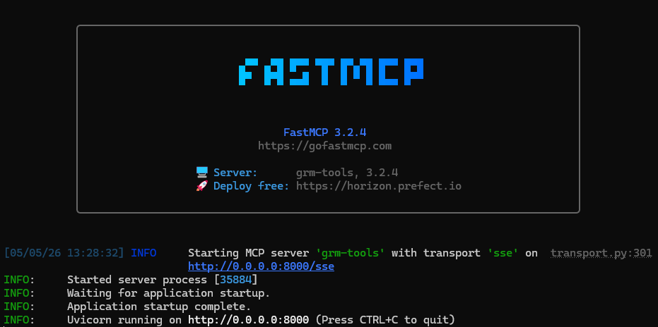
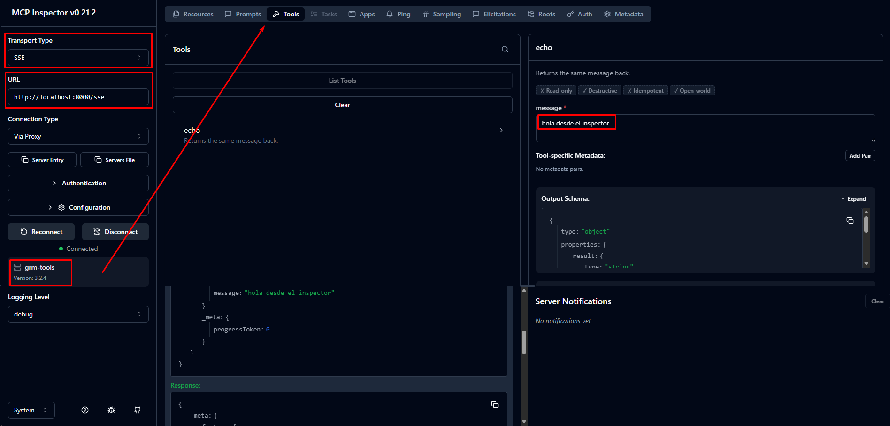
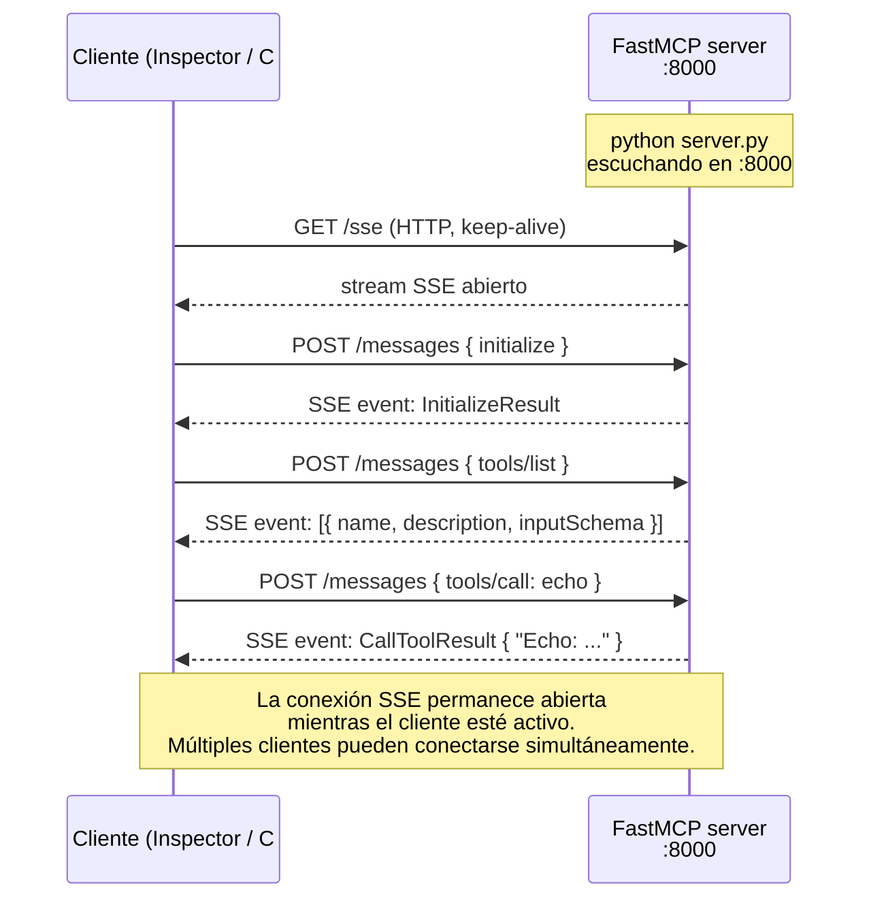

# Lab 3 — Construir un servidor MCP en Python

**Duración**: 35 min  
**Objetivo**: Crear un servidor MCP funcional en Python con `fastmcp`, exponer herramientas útiles y usar transporte **HTTP+SSE** para que pueda ser consumido desde un cliente C# o cualquier cliente remoto.

## ¿Qué es FastMCP?

[FastMCP](https://github.com/jlowin/fastmcp) es un framework Python de alto nivel para construir servidores MCP. Abstrae todo el protocolo JSON-RPC y el ciclo de vida del servidor — tú solo defines funciones Python decoradas y FastMCP las expone automáticamente como tools, resources o prompts MCP.

```python
# Sin FastMCP: implementar JSON-RPC, schemas, transportes, lifecycle...
# Con FastMCP:
@mcp.tool()
def mi_tool(texto: str) -> str:
    return texto.upper()
```

FastMCP infiere el schema JSON de los type hints de Python, genera las descripciones a partir de los docstrings y gestiona la serialización. En el fondo usa [Pydantic](https://docs.pydantic.dev/) para la validación.

> **Referencias**
> - Repositorio: https://github.com/jlowin/fastmcp
> - Documentación: https://gofastmcp.com
> - SDK oficial MCP Python (nivel bajo, sin abstracciones): https://github.com/modelcontextprotocol/python-sdk

---

> [!NOTE]
> **El cambio de transporte que lo cambia todo**
>
> En los Labs 1 y 2 todos los servidores usaban `stdio`: se arrancan como subprocesos y solo aceptan un cliente a la vez (el proceso que los lanzó).
>
> A partir de este lab usamos `transport="sse"`: el servidor Python arranca como un **servicio HTTP** en `localhost:8000`. Cualquier cliente en la misma red puede conectarse — incluyendo el cliente C# del Lab 4 o el agente del Lab 5.

---

## Prerrequisitos

- Python 3.11+ y `uv` instalados
- MCP Inspector disponible: `npx @modelcontextprotocol/inspector`

---

## Pasos

### 1. Crear el proyecto Python

`uv venv` crea un entorno virtual Python aislado en `.venv/` — así las dependencias de este proyecto no interfieren con el resto del sistema. Después hay que **activarlo** para que el terminal use ese entorno al ejecutar `python` o `pip`.

**PowerShell (Windows):**

```powershell
cd sample-server
uv venv
.venv\Scripts\Activate.ps1

uv pip install "mcp[cli]" fastmcp --native-tls
```

> [!TIP]
> Con `uv` también puedes saltarte la activación manual y arrancar directamente con `uv run server.py`. El entorno se gestiona solo. Útil si no quieres activar/desactivar manualmente.

### 2. Crear el servidor mínimo

Crea `server.py` con VS Code y copia el código:

```powershell
code server.py
```

```python
from fastmcp import FastMCP

mcp = FastMCP("grm-tools")

@mcp.tool()
def echo(message: str) -> str:
    """Returns the same message back."""
    return f"Echo: {message}"

if __name__ == "__main__":
    mcp.run(transport="sse", host="0.0.0.0", port=8000)
```

Arrancar:

```powershell
python server.py
```

Verás la pantalla de arranque de FastMCP:



El servidor está ahora escuchando peticiones HTTP.A diferencia del stdio de los labs anteriores, este proceso **no termina** hasta que lo paras manualmente.

### 3. Verificar con MCP Inspector

```bash
npx @modelcontextprotocol/inspector
```

En el Inspector, la configuración cambia respecto a los Labs 1 y 2:

| Campo | Valor |
|---|---|
| **Transport Type** | `SSE` (no stdio) |
| **URL** | `http://localhost:8000/sse` |

Haz clic en **Connect**. El indicador verde confirma la conexión.



Ve a **Tools** y haz clic en **List Tools**: verás `echo`. Llámala con `message: "hola desde el inspector"`.

### 4. Añadir una tool que el LLM no puede hacer solo

El verdadero poder de MCP no está en manipular strings — está en dar al LLM **acceso a recursos externos** que por sí solo no puede alcanzar.

Instala `httpx` en el entorno virtual:

```powershell
uv pip install httpx
```

Añade la tool al `server.py`:

```python
import httpx

@mcp.tool()
def fetch_url(url: str, max_chars: int = 2000) -> dict:
    """Fetches the content of a URL and returns it as text.

    Args:
        url: The URL to fetch.
        max_chars: Maximum number of characters to return (default 2000).
    """
    response = httpx.get(url, follow_redirects=True, timeout=10, verify=False)
    content = response.text[:max_chars]
    return {
        "url": url,
        "status_code": response.status_code,
        "content": content,
        "truncated": len(response.text) > max_chars,
    }
```

> [!NOTE]
> **Proxy corporativo**: si la red intercepta el tráfico TLS (proxy con certificado autofirmado), `httpx` fallará con `CERTIFICATE_VERIFY_FAILED`. El `verify=False` desactiva la verificación SSL — válido para un lab interno. En producción lo correcto es pasar el bundle del proxy: `verify="/ruta/al/cert.pem"`.

Reinicia el servidor y pruébala en el Inspector con `url: "https://example.com"`.

> [!NOTE]
> Un LLM sin tools no puede hacer peticiones HTTP — no tiene acceso a la red. Con esta tool, cualquier agente que use tu servidor MCP puede navegar URLs bajo demanda. Esto es exactamente lo que hacen los MCP servers de búsqueda web (Brave Search, Exa, etc.).

### 5. Exponer un Resource

**¿Cuándo usar un resource en lugar de una tool?**

| | Tool | Resource |
|---|---|---|
| **Cuándo** | Acción o cálculo | Lectura de contexto/datos |
| **Ejemplo** | `fetch_url`, `send_email` | `docs://coding-standards`, `config://env` |
| **El LLM puede...** | llamarlo cuando necesite | leerlo como contexto antes de responder |

**Caso real**: tu equipo tiene convenciones de código. En lugar de pegarlas en cada system prompt, las expones como resource. El agente las lee automáticamente cuando el usuario hace preguntas de código.

Añade al `server.py`:

```python
@mcp.resource("docs://coding-standards")
def get_coding_standards() -> dict:
    """Returns the team's coding standards and conventions."""
    return {
        "language": "C# / Python",
        "conventions": [
            "Use PascalCase for classes, camelCase for variables",
            "All secrets via User Secrets or Key Vault — never in appsettings",
            "Azure credential: DefaultAzureCredential in DEBUG, ManagedIdentity in deployed envs",
            "Max method length: 30 lines",
            "All public methods must have XML doc comments",
        ],
        "architecture": "Clean Architecture — Domain / Application / Infrastructure / API",
        "git": "Conventional Commits: feat:, fix:, docs:, refactor:",
    }
```

Reinicia el servidor y abre la pestaña **Resources** del Inspector. Verás `docs://coding-standards` listado. Al hacer clic, el Inspector llama al resource y muestra el JSON — exactamente lo que recibirá el LLM antes de responder preguntas de código.

> [!TIP]
> En el Lab 5 verás cómo un agente Azure AI lee automáticamente este resource para dar respuestas alineadas con las convenciones del equipo.

---

## Estructura final del servidor

```
sample-server/
├── server.py          # FastMCP app con todas las tools
├── pyproject.toml     # (opcional: gestión de dependencias formal)
└── .venv/
```

---

## Qué ha pasado por debajo

Con `transport="sse"` el flujo es muy diferente a stdio. El servidor levanta un servidor HTTP con dos endpoints:

- `GET /sse` — abre un stream de eventos que el cliente mantiene abierto para recibir notificaciones
- `POST /messages` — el cliente envía cada petición JSON-RPC aquí



**Por qué HTTP+SSE y no WebSockets o polling:**
- SSE es unidireccional server→client, más simple de implementar y depurar
- Las peticiones del cliente van como POST HTTP normales — fáciles de proxiar, loguear y autenticar
- Los clientes `.NET` (`ModelContextProtocol.Client`) implementan SSE de forma nativa

> Para ver el JSON exacto de cada intercambio (`initialize`, `tools/list`, `tools/call`...), consulta la sección [Los mensajes en el cable](../../../mcp-fundamentals/README.md#los-mensajes-en-el-cable) en los fundamentos.

---

## Preguntas de reflexión

> [!NOTE]
> Intenta responder antes de desplegar. Son conceptos clave para el Lab 4 (cliente C#).

---

**1. ¿Por qué usamos `transport="sse"` en este lab y no `transport="stdio"` como en los labs anteriores?**

<details>
<summary>Mostrar respuesta</summary>

> Con stdio, el servidor solo acepta un cliente: el proceso que lo arrancó. Con SSE, el servidor escucha en un puerto HTTP y acepta conexiones simultáneas de múltiples clientes.

Esto es imprescindible para el Lab 4: el cliente C# (`ModelContextProtocol.Client`) no puede arrancar un subproceso Python — necesita conectarse a un endpoint HTTP ya levantado.

Además, en producción los servidores MCP son servicios remotos (deployados en Azure, por ejemplo). Un cliente en una máquina diferente no puede usar stdio.

</details>

---

**2. ¿Cómo añadirías autenticación Bearer al servidor?**

<details>
<summary>Mostrar respuesta</summary>

> `fastmcp` no tiene autenticación incorporada, pero el servidor corre sobre `uvicorn` (ASGI), así que puedes añadir middleware de autenticación.

Opción práctica con un middleware simple:

```python
from starlette.middleware.base import BaseHTTPMiddleware
from starlette.responses import JSONResponse

class BearerAuthMiddleware(BaseHTTPMiddleware):
    async def dispatch(self, request, call_next):
        token = request.headers.get("Authorization", "")
        if token != "Bearer mi-token-secreto":
            return JSONResponse({"error": "Unauthorized"}, status_code=401)
        return await call_next(request)

mcp.app.add_middleware(BearerAuthMiddleware)
```

En producción lo habitual es usar un API Gateway (Azure APIM) delante del servidor MCP y delegar la autenticación ahí.

</details>

---

**3. ¿Qué pasa si el LLM llama a una tool con argumentos incorrectos? ¿Cómo manejarlo?**

<details>
<summary>Mostrar respuesta</summary>

> `fastmcp` valida automáticamente los argumentos contra el schema de la función (tipado Python + Pydantic). Si los argumentos no coinciden, el servidor devuelve un error JSON-RPC `InvalidParams` antes de ejecutar la función.

Para errores de negocio (argumentos válidos pero resultado imposible), lo correcto es lanzar una excepción en Python — `fastmcp` la captura y la convierte en un `CallToolResult` con `isError: true`:

```python
@mcp.tool()
def divide(a: float, b: float) -> float:
    """Divides a by b."""
    if b == 0:
        raise ValueError("Cannot divide by zero")
    return a / b
```

El LLM recibe el mensaje de error y puede decidir qué hacer (reintentar con otros argumentos, informar al usuario, etc.).

</details>

---

## Siguiente paso

[Lab 4 — Cliente C# con ModelContextProtocol.Client](../04-client-connect/README.md)

