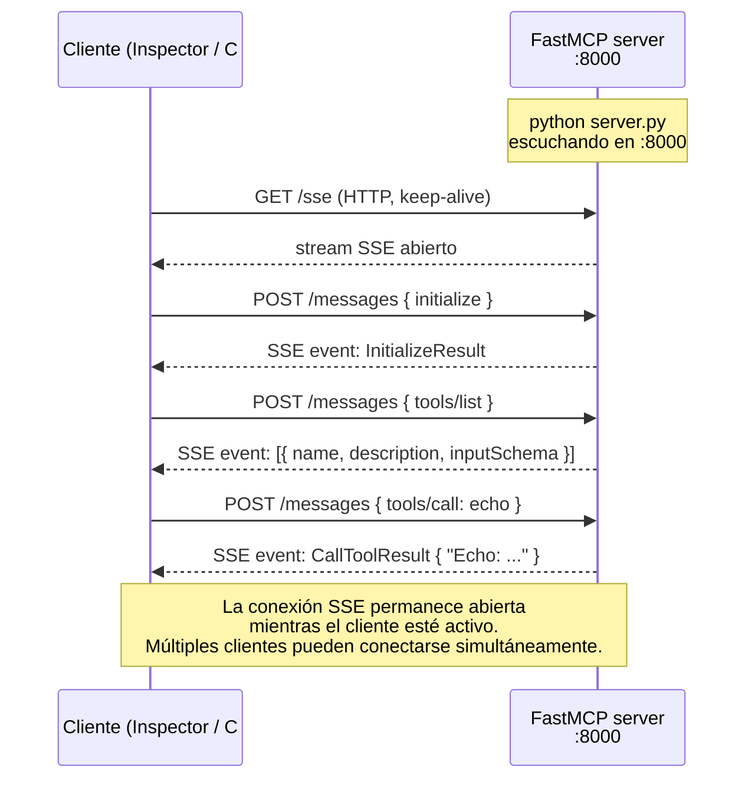

# Lab 3 — Construir un servidor MCP en Python

**Duración**: 35 min  
**Objetivo**: Crear un servidor MCP funcional en Python con `fastmcp`, exponer herramientas útiles y usar transporte **HTTP+SSE** para que pueda ser consumido desde un cliente C# o cualquier cliente remoto.

## ¿Qué es FastMCP?

[FastMCP](https://github.com/jlowin/fastmcp) es un framework Python de alto nivel para construir servidores MCP. Abstrae todo el protocolo JSON-RPC y el ciclo de vida del servidor — tú solo defines funciones Python decoradas y FastMCP las expone automáticamente como tools, resources o prompts MCP.

```python
# Sin FastMCP: implementar JSON-RPC, schemas, transportes, lifecycle...
# Con FastMCP:
@mcp.tool()
def mi_tool(texto: str) -> str:
    return texto.upper()
```

FastMCP infiere el schema JSON de los type hints de Python, genera las descripciones a partir de los docstrings y gestiona la serialización. En el fondo usa [Pydantic](https://docs.pydantic.dev/) para la validación.

> **Referencias**
> - Repositorio: https://github.com/jlowin/fastmcp
> - Documentación: https://gofastmcp.com
> - SDK oficial MCP Python (nivel bajo, sin abstracciones): https://github.com/modelcontextprotocol/python-sdk

---

> [!NOTE]
> **El cambio de transporte que lo cambia todo**
>
> En los Labs 1 y 2 todos los servidores usaban `stdio`: se arrancan como subprocesos y solo aceptan un cliente a la vez (el proceso que los lanzó).
>
> A partir de este lab usamos `transport="sse"`: el servidor Python arranca como un **servicio HTTP** en `localhost:8000`. Cualquier cliente en la misma red puede conectarse — incluyendo el cliente C# del Lab 4 o el agente del Lab 5.

---

## Prerrequisitos

- Python 3.11+ y `uv` instalados
- MCP Inspector disponible: `npx @modelcontextprotocol/inspector`

---

## Pasos

### 1. Crear el proyecto Python

`uv venv` crea un entorno virtual Python aislado en `.venv/` — así las dependencias de este proyecto no interfieren con el resto del sistema. Después hay que **activarlo** para que el terminal use ese entorno al ejecutar `python` o `pip`.

**PowerShell (Windows):**

```powershell
cd sample-server
uv venv
.venv\Scripts\Activate.ps1

uv pip install "mcp[cli]" fastmcp --native-tls
```

> [!TIP]
> Con `uv` también puedes saltarte la activación manual y arrancar directamente con `uv run server.py`. El entorno se gestiona solo. Útil si no quieres activar/desactivar manualmente.

### 2. Crear el servidor mínimo

Crea `server.py` con VS Code y copia el código:

```powershell
code server.py
```

```python
from fastmcp import FastMCP

mcp = FastMCP("grm-tools")

@mcp.tool()
def echo(message: str) -> str:
    """Returns the same message back."""
    return f"Echo: {message}"

if __name__ == "__main__":
    mcp.run(transport="sse", host="0.0.0.0", port=8000)
```

Arrancar:

```powershell
python server.py
```

Verás la pantalla de arranque de FastMCP:


El servidor está ahora escuchando peticiones HTTP.A diferencia del stdio de los labs anteriores, este proceso **no termina** hasta que lo paras manualmente.

### 3. Verificar con MCP Inspector

```bash
npx @modelcontextprotocol/inspector
```

En el Inspector, la configuración cambia respecto a los Labs 1 y 2:

| Campo | Valor |
|---|---|
| **Transport Type** | `SSE` (no stdio) |
| **URL** | `http://localhost:8000/sse` |

Haz clic en **Connect**. El indicador verde confirma la conexión.


Ve a **Tools** y haz clic en **List Tools**: verás `echo`. Llámala con `message: "hola desde el inspector"`.

### 4. Añadir tools que consultan la base de datos

Hasta ahora el servidor solo manipula strings. El verdadero poder de MCP está en dar al LLM **acceso a datos reales** que por sí solo no puede alcanzar.

Primero crea la base de datos de ejemplo. Es un SQLite con 10 clientes y 25 pedidos — sin servidor ni credenciales, solo un fichero:

```powershell
python db/seed.py
# Base de datos creada en db/grm_demo.db
# 10 clientes  |  25 pedidos
```

Ahora añade las dos tools al `server.py`:

```python
import sqlite3
from pathlib import Path

DB_PATH = Path(__file__).parent / "db" / "grm_demo.db"

def _db():
    conn = sqlite3.connect(DB_PATH)
    conn.row_factory = sqlite3.Row
    return conn

@mcp.tool()
def search_customers(name: str = "", city: str = "", segment: str = "") -> list[dict]:
    """Search customers in the database. All filters are optional and case-insensitive.

    Args:
        name:    Partial customer name to search for.
        city:    City to filter by.
        segment: Customer segment: A (top), B (medium) or C (small). Leave empty for all.
    """
    query = "SELECT * FROM clientes WHERE 1=1"
    params: list = []
    if name:
        query += " AND nombre LIKE ?"
        params.append(f"%{name}%")
    if city:
        query += " AND ciudad LIKE ?"
        params.append(f"%{city}%")
    if segment:
        query += " AND segmento = ?"
        params.append(segment.upper())
    query += " ORDER BY segmento, nombre"

    with _db() as conn:
        rows = conn.execute(query, params).fetchall()
    return [dict(r) for r in rows]

@mcp.tool()
def get_customer_orders(customer_id: int, status: str = "") -> list[dict]:
    """Get orders for a specific customer. Optionally filter by status.

    Args:
        customer_id: The customer ID.
        status:      Order status: pendiente, enviado, entregado or cancelado.
    """
    query = "SELECT * FROM pedidos WHERE cliente_id = ?"
    params: list = [customer_id]
    if status:
        query += " AND estado = ?"
        params.append(status.lower())
    query += " ORDER BY fecha DESC"

    with _db() as conn:
        rows = conn.execute(query, params).fetchall()
    return [dict(r) for r in rows]
```

Reinicia el servidor y prueba en el Inspector:

| Tool | Argumentos de prueba |
|---|---|
| `search_customers` | `segment: "A"` |
| `search_customers` | `city: "Madrid"` |
| `get_customer_orders` | `customer_id: 1` |
| `get_customer_orders` | `customer_id: 5, status: "enviado"` |

Observa la diferencia clave: **el LLM decide cuándo llamar a la tool y con qué filtros**. En una conversación real podría hacer `search_customers(city="Valencia")` por sí solo si el usuario pregunta "¿qué clientes tenemos en Valencia?".

> [!NOTE]
> **Ejemplo auxiliar — tool que hace algo que el LLM no puede hacer solo**
>
> Instala `httpx` (`uv pip install httpx`) y añade esta tool para fetchear URLs:
>
> ```python
> import httpx
>
> @mcp.tool()
> def fetch_url(url: str, max_chars: int = 2000) -> dict:
>     """Fetches the content of a URL and returns it as text."""
>     response = httpx.get(url, follow_redirects=True, timeout=10, verify=False)
>     content = response.text[:max_chars]
>     return {"url": url, "status_code": response.status_code,
>             "content": content, "truncated": len(response.text) > max_chars}
> ```
>
> Un LLM sin tools no tiene acceso a la red. Con esta tool, cualquier agente puede navegar URLs bajo demanda — exactamente lo que hacen los servidores MCP de búsqueda (Brave Search, Exa, etc.).

### 5. Exponer Resources

**El cambio de mental model**: las tools las *invoca el LLM* cuando decide que las necesita. Los resources los *lee el HOST* (tu agente, el IDE...) y los inyecta en el contexto **antes** de que el LLM responda. Es RAG sin infraestructura.

| | Tool | Resource |
|---|---|---|
| **Quién decide usarlo** | El LLM | El HOST / el usuario |
| **Cuándo** | Acción o cálculo bajo demanda | Contexto que el LLM debe conocer antes de responder |
| **Analogía** | Función que llamas | Documento que adjuntas al chat |

Añade los dos resources al `server.py`:

```python
@mcp.resource("db://schema")
def get_db_schema() -> dict:
    """Returns the database schema: tables, columns and value ranges."""
    return {
        "tables": {
            "clientes": {
                "columns": ["id", "nombre", "ciudad", "email", "segmento"],
                "segmento_values": ["A (top)", "B (medium)", "C (small)"],
            },
            "pedidos": {
                "columns": ["id", "cliente_id", "fecha", "importe", "estado"],
                "estado_values": ["pendiente", "enviado", "entregado", "cancelado"],
            },
        },
        "relationships": "pedidos.cliente_id → clientes.id",
    }

@mcp.resource("db://customers/{customer_id}")
def get_customer_profile(customer_id: str) -> dict:
    """Returns the full profile and order summary for a specific customer."""
    with _db() as conn:
        customer = conn.execute(
            "SELECT * FROM clientes WHERE id = ?", [customer_id]
        ).fetchone()
        if not customer:
            return {"error": f"Customer {customer_id} not found"}
        orders = conn.execute(
            """SELECT estado, COUNT(*) as count, SUM(importe) as total
               FROM pedidos WHERE cliente_id = ? GROUP BY estado""",
            [customer_id],
        ).fetchall()
    return {
        "customer": dict(customer),
        "orders_by_status": [dict(r) for r in orders],
        "total_revenue": sum(r["total"] for r in orders),
    }
```

Reinicia y abre **Resources** en el Inspector:

- `db://schema` — haz clic para leer: el LLM puede usar este contexto para saber qué puede preguntar antes de decidir qué tool llamar
- `db://customers/1` — escribe la URI en el campo y pulsa **Read Resource**: devuelve el perfil completo de Transportes Romeu con el resumen de pedidos agrupado por estado

> [!TIP]
> En el Lab 5 el agente inyecta `db://schema` como contexto inicial para que el LLM conozca la estructura antes de responder cualquier pregunta sobre clientes.

> [!NOTE]
> **Ejemplo auxiliar — resource estático de documentación del equipo**
>
> ```python
> @mcp.resource("docs://coding-standards")
> def get_coding_standards() -> dict:
>     """Returns the team's coding standards and conventions."""
>     return {
>         "conventions": ["PascalCase for classes", "Secrets via Key Vault", ...],
>         "architecture": "Clean Architecture",
>         "git": "Conventional Commits",
>     }
> ```
>
> Un agente que tiene este resource en contexto respeta automáticamente los estándares del equipo sin que se los tengas que repetir en cada prompt.

### 6. Exponer un Prompt

**Los prompts MCP** son plantillas que el servidor fabrica una vez y cualquier cliente reutiliza. El experto en dominio define el prompt perfecto; el equipo entero lo usa con cualquier LLM.

A diferencia de las tools y los resources, **el prompt puede leer la BBDD en el momento de construirse** y devolver un mensaje ya hidratado con datos reales:

```python
from fastmcp.prompts import Message

@mcp.prompt
def customer_summary(customer_id: str) -> str:
    """Generates an analysis prompt for a specific customer using live DB data."""
    with _db() as conn:
        customer = conn.execute(
            "SELECT * FROM clientes WHERE id = ?", [customer_id]
        ).fetchone()
        orders = conn.execute(
            "SELECT * FROM pedidos WHERE cliente_id = ? ORDER BY fecha DESC",
            [customer_id],
        ).fetchall()

    if not customer:
        return f"No se encontró el cliente con ID {customer_id}."

    orders_text = "\n".join(
        f"  - Pedido {o['id']}: {o['fecha']}  {o['importe']:,.2f}€  [{o['estado']}]"
        for o in orders
    )
    total = sum(o["importe"] for o in orders)

    return f"""Eres un analista comercial. Analiza el siguiente cliente y sus pedidos:

CLIENTE:
  Nombre:   {customer['nombre']}
  Ciudad:   {customer['ciudad']}
  Segmento: {customer['segmento']}

PEDIDOS ({len(orders)} en total, {total:,.2f}€ facturado):
{orders_text}

Por favor:
1. Resume el comportamiento de compra del cliente
2. Identifica si hay pedidos problemáticos (cancelados o pendientes antiguos)
3. Propón una acción comercial concreta para el próximo trimestre"""
```

Reinicia. En la pestaña **Prompts** del Inspector selecciona `customer_summary`, introduce `customer_id: 1` y haz clic en **Get Prompt**. Verás el mensaje completo ya construido con los datos reales de Transportes Romeu — listo para enviarlo a cualquier LLM.

En **GitHub Copilot para VS Code** (con MCP habilitado) el prompt aparece como slash command: escribe `/mcp.FormacionMcp.customer_summary` en el chat, introduce el ID y Copilot lanza el análisis directamente.

> [!NOTE]
> **La diferencia clave entre las tres primitivas con el mismo dataset:**
>
> ```
> Tool   search_customers(city="Valencia")  →  el LLM decide cuándo buscar
> Resource db://customers/1                →  el HOST inyecta el perfil en contexto
> Prompt customer_summary(1)              →  combina datos + instrucciones en un mensaje listo
> ```

> [!NOTE]
> **Ejemplo auxiliar — prompt para debugging .NET**
>
> Si el prompt no necesita datos externos, devuelve simplemente un string:
>
> ```python
> @mcp.prompt
> def debug_error(error_message: str, service: str = "unknown") -> str:
>     """Generates a structured debugging prompt for a .NET error."""
>     return f"""Eres un senior developer .NET. Analiza este error del servicio '{service}':
> ERROR: {error_message}
> 1. Identifica la causa raíz
> 2. Sugiere 3 posibles fixes ordenados por probabilidad
> 3. Muestra el código corregido si aplica"""
>
> @mcp.prompt
> def code_review(code: str, language: str = "csharp") -> list[Message]:
>     """Generates a code review conversation."""
>     return [
>         Message("You are a senior developer specialized in Clean Architecture.", role="assistant"),
>         Message(f"Review this {language} code:\n\n```{language}\n{code}\n```"),
>     ]
> ```

---

## Estructura final del servidor

```
sample-server/
├── server.py          # FastMCP app con tools, resources y prompts
├── db/
│   ├── seed.py        # Crea y puebla grm_demo.db (ejecutar una vez)
│   └── grm_demo.db    # SQLite generado — no se sube al repo
└── .venv/
```

---

## Qué ha pasado por debajo

Con `transport="sse"` el flujo es muy diferente a stdio. El servidor levanta un servidor HTTP con dos endpoints:

- `GET /sse` — abre un stream de eventos que el cliente mantiene abierto para recibir notificaciones
- `POST /messages` — el cliente envía cada petición JSON-RPC aquí



**Por qué HTTP+SSE y no WebSockets o polling:**
- SSE es unidireccional server→client, más simple de implementar y depurar
- Las peticiones del cliente van como POST HTTP normales — fáciles de proxiar, loguear y autenticar
- Los clientes `.NET` (`ModelContextProtocol.Client`) implementan SSE de forma nativa

> Para ver el JSON exacto de cada intercambio (`initialize`, `tools/list`, `tools/call`...), consulta la sección [Los mensajes en el cable](../../../mcp-fundamentals/README.md#los-mensajes-en-el-cable) en los fundamentos.

---

## Preguntas de reflexión

> [!NOTE]
> Intenta responder antes de desplegar. Son conceptos clave para el Lab 4 (cliente C#).

---

**1. ¿Por qué usamos `transport="sse"` en este lab y no `transport="stdio"` como en los labs anteriores?**

<details>
<summary>Mostrar respuesta</summary>

> Con stdio, el servidor solo acepta un cliente: el proceso que lo arrancó. Con SSE, el servidor escucha en un puerto HTTP y acepta conexiones simultáneas de múltiples clientes.

Esto es imprescindible para el Lab 4: el cliente C# (`ModelContextProtocol.Client`) no puede arrancar un subproceso Python — necesita conectarse a un endpoint HTTP ya levantado.

Además, en producción los servidores MCP son servicios remotos (deployados en Azure, por ejemplo). Un cliente en una máquina diferente no puede usar stdio.

</details>

---

**2. ¿Cómo añadirías autenticación Bearer al servidor?**

<details>
<summary>Mostrar respuesta</summary>

> `fastmcp` no tiene autenticación incorporada, pero el servidor corre sobre `uvicorn` (ASGI), así que puedes añadir middleware de autenticación.

Opción práctica con un middleware simple:

```python
from starlette.middleware.base import BaseHTTPMiddleware
from starlette.responses import JSONResponse

class BearerAuthMiddleware(BaseHTTPMiddleware):
    async def dispatch(self, request, call_next):
        token = request.headers.get("Authorization", "")
        if token != "Bearer mi-token-secreto":
            return JSONResponse({"error": "Unauthorized"}, status_code=401)
        return await call_next(request)

mcp.app.add_middleware(BearerAuthMiddleware)
```

En producción lo habitual es usar un API Gateway (Azure APIM) delante del servidor MCP y delegar la autenticación ahí.

</details>

---

**3. ¿Qué pasa si el LLM llama a una tool con argumentos incorrectos? ¿Cómo manejarlo?**

<details>
<summary>Mostrar respuesta</summary>

> `fastmcp` valida automáticamente los argumentos contra el schema de la función (tipado Python + Pydantic). Si los argumentos no coinciden, el servidor devuelve un error JSON-RPC `InvalidParams` antes de ejecutar la función.

Para errores de negocio (argumentos válidos pero resultado imposible), lo correcto es lanzar una excepción en Python — `fastmcp` la captura y la convierte en un `CallToolResult` con `isError: true`:

```python
@mcp.tool()
def divide(a: float, b: float) -> float:
    """Divides a by b."""
    if b == 0:
        raise ValueError("Cannot divide by zero")
    return a / b
```

El LLM recibe el mensaje de error y puede decidir qué hacer (reintentar con otros argumentos, informar al usuario, etc.).

</details>

---

## Siguiente paso

[Lab 4 — Cliente C# con ModelContextProtocol.Client](../04-client-connect/README.md)

