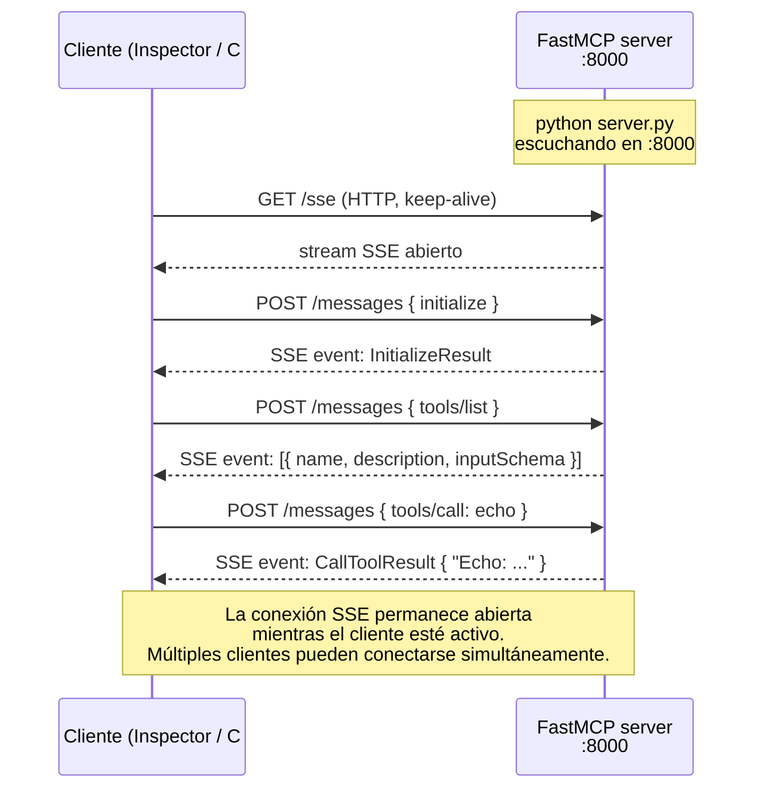

# Lab 3 — Construir un servidor MCP en Python

**Duración**: 35 min  
**Objetivo**: Crear un servidor MCP funcional en Python con `fastmcp`, exponer herramientas útiles y usar transporte **HTTP+SSE** para que pueda ser consumido desde un cliente C# o cualquier cliente remoto.

> [!NOTE]
> **El cambio de transporte que lo cambia todo**
>
> En los Labs 1 y 2 todos los servidores usaban `stdio`: se arrancan como subprocesos y solo aceptan un cliente a la vez (el proceso que los lanzó).
>
> A partir de este lab usamos `transport="sse"`: el servidor Python arranca como un **servicio HTTP** en `localhost:8000`. Cualquier cliente en la misma red puede conectarse — incluyendo el cliente C# del Lab 4 o el agente del Lab 5.

---

## Prerrequisitos

- Python 3.11+ y `uv` instalados
- MCP Inspector disponible: `npx @modelcontextprotocol/inspector`

---

## Pasos

### 1. Crear el proyecto Python

```bash
cd sample-server
uv venv
# En Windows: .venv\Scripts\activate
# En macOS/Linux: source .venv/bin/activate
source .venv/bin/activate

uv pip install "mcp[cli]" fastmcp
```

### 2. Crear el servidor mínimo

Crea `server.py`:

```python
from fastmcp import FastMCP

mcp = FastMCP("grm-tools")

@mcp.tool()
def echo(message: str) -> str:
    """Returns the same message back."""
    return f"Echo: {message}"

if __name__ == "__main__":
    mcp.run(transport="sse", host="0.0.0.0", port=8000)
```

Arrancar:

```bash
python server.py
```

Verás en consola algo como:

```
INFO:     Started server process [12345]
INFO:     Waiting for application startup.
INFO:     Application startup complete.
INFO:     Uvicorn running on http://0.0.0.0:8000 (Press CTRL+C to quit)
```

El servidor está ahora escuchando peticiones HTTP. A diferencia del stdio de los labs anteriores, este proceso **no termina** hasta que lo paras manualmente.

### 3. Verificar con MCP Inspector

```bash
npx @modelcontextprotocol/inspector
```

En el Inspector, la configuración cambia respecto a los Labs 1 y 2:

| Campo | Valor |
|---|---|
| **Transport Type** | `SSE` (no stdio) |
| **URL** | `http://localhost:8000/sse` |

Haz clic en **Connect**. El indicador verde confirma la conexión.

Ve a **Tools** y haz clic en **List Tools**: verás `echo`. Llámala con `message: "hola desde el inspector"`.

### 4. Añadir una tool más útil

Añade una tool que procese texto:

```python
@mcp.tool()
def process_text(text: str, max_words: int = 50) -> dict:
    """Processes text: uppercases it and limits to max_words words.
    
    Args:
        text: Input text to process.
        max_words: Maximum number of words to return.
    """
    words = text.split()[:max_words]
    return {
        "original_length": len(text.split()),
        "truncated": len(text.split()) > max_words,
        "result": " ".join(words).upper()
    }
```

Reinicia el servidor (`CTRL+C` y vuelve a ejecutar `python server.py`) y verifica la nueva tool en MCP Inspector.

> No necesitas reconectar el Inspector: al reconectar ve directamente a **Tools → List Tools** para ver la lista actualizada.

### 5. Exponer un Resource (opcional)

```python
@mcp.resource("config://server-info")
def get_server_info() -> str:
    """Returns server configuration info."""
    return "GRM MCP Server v1.0 — HTTP+SSE transport"
```

Reinicia el servidor y verifica el resource en la pestaña **Resources** del Inspector.

---

## Estructura final del servidor

```
sample-server/
├── server.py          # FastMCP app con todas las tools
├── pyproject.toml     # (opcional: gestión de dependencias formal)
└── .venv/
```

---

## Qué ha pasado por debajo

Con `transport="sse"` el flujo es muy diferente a stdio. El servidor levanta un servidor HTTP con dos endpoints:

- `GET /sse` — abre un stream de eventos que el cliente mantiene abierto para recibir notificaciones
- `POST /messages` — el cliente envía cada petición JSON-RPC aquí



**Por qué HTTP+SSE y no WebSockets o polling:**
- SSE es unidireccional server→client, más simple de implementar y depurar
- Las peticiones del cliente van como POST HTTP normales — fáciles de proxiar, loguear y autenticar
- Los clientes `.NET` (`ModelContextProtocol.Client`) implementan SSE de forma nativa

---

## Preguntas de reflexión

> [!NOTE]
> Intenta responder antes de desplegar. Son conceptos clave para el Lab 4 (cliente C#).

---

**1. ¿Por qué usamos `transport="sse"` en este lab y no `transport="stdio"` como en los labs anteriores?**

<details>
<summary>Mostrar respuesta</summary>

> Con stdio, el servidor solo acepta un cliente: el proceso que lo arrancó. Con SSE, el servidor escucha en un puerto HTTP y acepta conexiones simultáneas de múltiples clientes.

Esto es imprescindible para el Lab 4: el cliente C# (`ModelContextProtocol.Client`) no puede arrancar un subproceso Python — necesita conectarse a un endpoint HTTP ya levantado.

Además, en producción los servidores MCP son servicios remotos (deployados en Azure, por ejemplo). Un cliente en una máquina diferente no puede usar stdio.

</details>

---

**2. ¿Cómo añadirías autenticación Bearer al servidor?**

<details>
<summary>Mostrar respuesta</summary>

> `fastmcp` no tiene autenticación incorporada, pero el servidor corre sobre `uvicorn` (ASGI), así que puedes añadir middleware de autenticación.

Opción práctica con un middleware simple:

```python
from starlette.middleware.base import BaseHTTPMiddleware
from starlette.responses import JSONResponse

class BearerAuthMiddleware(BaseHTTPMiddleware):
    async def dispatch(self, request, call_next):
        token = request.headers.get("Authorization", "")
        if token != "Bearer mi-token-secreto":
            return JSONResponse({"error": "Unauthorized"}, status_code=401)
        return await call_next(request)

mcp.app.add_middleware(BearerAuthMiddleware)
```

En producción lo habitual es usar un API Gateway (Azure APIM) delante del servidor MCP y delegar la autenticación ahí.

</details>

---

**3. ¿Qué pasa si el LLM llama a una tool con argumentos incorrectos? ¿Cómo manejarlo?**

<details>
<summary>Mostrar respuesta</summary>

> `fastmcp` valida automáticamente los argumentos contra el schema de la función (tipado Python + Pydantic). Si los argumentos no coinciden, el servidor devuelve un error JSON-RPC `InvalidParams` antes de ejecutar la función.

Para errores de negocio (argumentos válidos pero resultado imposible), lo correcto es lanzar una excepción en Python — `fastmcp` la captura y la convierte en un `CallToolResult` con `isError: true`:

```python
@mcp.tool()
def divide(a: float, b: float) -> float:
    """Divides a by b."""
    if b == 0:
        raise ValueError("Cannot divide by zero")
    return a / b
```

El LLM recibe el mensaje de error y puede decidir qué hacer (reintentar con otros argumentos, informar al usuario, etc.).

</details>

---

## Siguiente paso

[Lab 4 — Cliente C# con ModelContextProtocol.Client](../04-client-connect/README.md)

