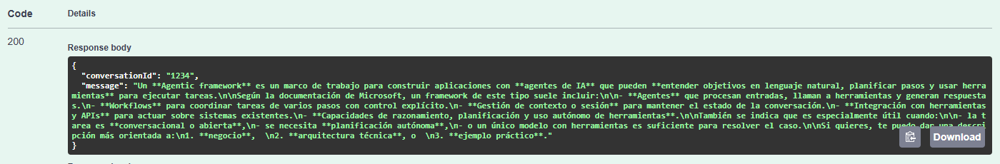
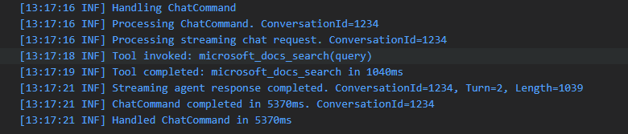
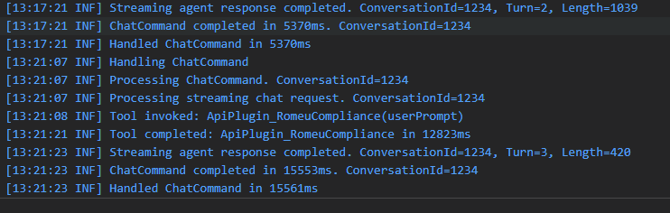
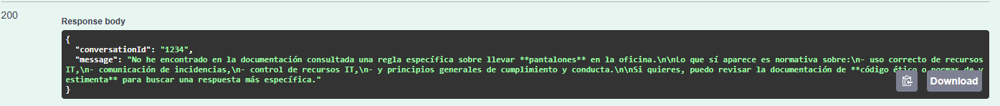

# Lab 4 — Crear un agente con la plantilla MAF

**Duración**: 30 min  
**Objetivo**: Generar un agente real a partir de la plantilla interna MAF y conectarlo a servidores MCP externos y propios.

---

## Prerrequisitos

- .NET 10 SDK instalado
- Git con acceso al repositorio Azure DevOps de la organización
- Servidor Python del Lab 3 arrancado (`python server.py` en `sample-server/`)

---

## Intro — Dos caminos para dar tools a un agente

La plantilla MAF permite conectar herramientas al agente de dos formas:

| Camino | Mecanismo | Cuándo usarlo |
|---|---|---|
| **MCP** | Protocolo JSON-RPC 2.0 sobre SSE | Servidores MCP: Lab 3, herramientas de terceros |
| **OpenAPI plugin** | Spec OpenAPI → `KernelFunction` | APIs REST propias ya existentes (sin servidor MCP) |

En este lab vamos a crear un agente con la plantilla, configurar el LLM y conectar los dos tipos de fuente.

---

## Paso 1 — Clonar e instalar la plantilla

Clona el repositorio de la plantilla MAF:

```bash
git clone https://gruporomeu@dev.azure.com/gruporomeu/AgentPlatform-Core/_git/maf-agent-template
cd maf-agent-template
```

Instala la plantilla dotnet (el flag `--force` reinstala si ya estuviera registrada):

```bash
dotnet new install .\maf-agent-template\ --force
```

Verifica que la plantilla está disponible:

```bash
dotnet new list maf
```

Deberías ver `maf-agent` en la lista.

---

## Paso 2 — Crear el proyecto `AgenteFormacionMcp`

Genera el proyecto a partir de la plantilla:

```bash
dotnet new maf-agent -n AgenteFormacionMcp -o C:\Users\palonso\source\repos\AgenteFormacionMcp
cd C:\Users\palonso\source\repos\AgenteFormacionMcp
```

Abre la solución en Visual Studio o VS Code:

```bash
code .
```

Explora la estructura generada:

```
AgenteFormacionMcp/
│
├── 01 - Domain/
│   ├── ChatFeature/
│   └── Common/
│
├── 02 - Business/
│   ├── Common/
│   │   └── Behaviors/
│   ├── DTOs/
│   ├── Features/
│   │   └── ChatFeature/
│   │       ├── Commands/
│   │       └── Validators/
│   └── Interfaces/
│
├── 03 - Infrastructure/
│   ├── Agent/
│   │   └── Functions/
│   ├── ApiPlugin/
│   │   └── Specs/
│   ├── Audit/
│   │   └── Entities/
│   ├── Authentication/
│   ├── Configuration/
│   ├── Extensions/
│   ├── Logging/
│   ├── Mcp/
│   │   └── OpenApi Definitions/
│   ├── Prompts/
│   └── SignalR/
│
├── 04 - Host/
│   ├── Features/
│   ├── Middleware/
│   └── Properties/
│
├── 05 - Tests/
│   ├── Business.Tests/
│   │   └── Features/
│   ├── Domain.Tests/
│   └── Integration.Tests/
│       ├── Agent/Functions/
│       ├── ApiPlugin/
│       ├── Audit/
│       ├── Auth/
│       ├── Mcp/
│       ├── Middleware/
│       └── SignalR/
│
└── 99 - Builds/
```

> [!NOTE]
> La configuración del servidor MCP vive en `03 - Infrastructure/Mcp/`. Las specs OpenAPI para el ApiPlugin van en `03 - Infrastructure/ApiPlugin/Specs/`. El punto de entrada HTTP está en `04 - Host/`.

---

## Paso 3 — Configurar los secrets del LLM e identidad

La plantilla usa [User Secrets](https://learn.microsoft.com/aspnet/core/security/app-secrets) para credenciales locales. Nunca uses `appsettings.Development.json` para valores sensibles.

Inicializa el almacén de secrets:

```bash
dotnet user-secrets init
```

Configura el endpoint y modelo del LLM:

```bash
# LLM
dotnet user-secrets set "Llm:Endpoint"        "https://<recurso>.openai.azure.com/"
dotnet user-secrets set "Llm:DeploymentName"  "gpt-4o"
```

La plantilla no usa API Key. En su lugar, la autenticación con Azure AI Foundry se delega a `DefaultAzureCredential`, que en local usa la sesión de `az login`. El cliente Swagger de test está registrado en Entra con los scopes necesarios para poder invocar el recurso de AI Foundry directamente desde el navegador.

Configura también los datos de identidad del tenant y la aplicación:

```bash
# Identity
dotnet user-secrets set "Identity:AzureAd:TenantId"              "<tenant-id>"
dotnet user-secrets set "Identity:AzureAd:ClientId"              "<client-id>"
dotnet user-secrets set "Identity:SwaggerClient:ClientId"        "<swagger-client-id>"
dotnet user-secrets set "Identity:SwaggerClient:Scopes"          "api://<client-id>/.default"
```

> [!NOTE]
> En producción (DEV/PRE/PRO) se usa `ManagedIdentityCredential` en lugar de `DefaultAzureCredential`. El código de la plantilla ya contempla el cambio según el entorno con `#if DEBUG`.

Verifica que los secrets están registrados:

```bash
dotnet user-secrets list
```

`appsettings.json` solo debe contener defaults no sensibles (timeouts, feature flags, logging).

---

## Paso 4 — Conectar al MCP de Microsoft Learn

Microsoft expone un servidor MCP público que permite consultar la documentación oficial de Microsoft Learn directamente desde cualquier agente compatible. El agente invocará la tool `microsoft_docs_search` cuando el usuario haga preguntas técnicas sobre tecnologías Microsoft.

Añade la configuración en `appsettings.json`:

```json
{
  "Mcp": {
    "SseEndpoint": "https://learn.microsoft.com/api/mcp",
    "TimeoutSeconds": 30
  }
}
```

Arranca el agente y abre Swagger en `https://localhost:<puerto>/swagger`. Envía esta petición:

```json
{
  "prompt": "dame una descripcion de Agentic framework"
}
```

El agente invocará automáticamente `microsoft_docs_search` y devolverá la respuesta:



En el log del agente verás la invocación de la tool:



Prueba también con:

```json
{
  "prompt": "qué es el protocolo MCP y cómo se integra con agentes de IA?"
}
```

---

## Paso 5 — Conectar una API REST via OpenAPI plugin

Además de MCP, la plantilla MAF permite exponer APIs REST existentes al agente mediante su spec OpenAPI. No necesitas un servidor MCP adicional: el agente genera `KernelFunction`s automáticamente a partir de la spec y las registra como tools disponibles para el LLM.

En este ejemplo conectamos el RAG de compliance de GRM, que responde preguntas sobre la documentación interna de la empresa.

Añade la configuración en `appsettings.json`:

```json
{
  "ApiPlugin": {
    "Name": "RomeuCompliance",
    "BaseUrl": "https://<apim-host>/compliance/",
    "OpenApiDefinitionUrl": "https://<apim-host>/compliance/openapi/json"
  }
}
```

Arranca el agente y envía en Swagger:

```json
{
  "prompt": "Puedo llevar pantalones en la oficina según la documentación de compliance de GRM?"
}
```

En el log verás que el agente ha invocado el plugin:



Y la respuesta del agente con la información extraída del RAG:



> [!NOTE]
> El nombre del plugin (`RomeuCompliance`) determina el prefijo que verás en los logs: `ApiPlugin_RomeuCompliance(userPrompt)`. Puedes cambiar el nombre en `appsettings.json` para adaptarlo a cualquier API.

---

## Paso 6 — Conectar al servidor MCP propio (Lab 3)

El servidor Python del Lab 3 es un servidor MCP válido. Para conectarlo al agente, modifica la configuración `Mcp` en `appsettings.json` apuntando a tu servidor local:

```json
{
  "Mcp": {
    "SseEndpoint": "http://localhost:8000/sse",
    "TimeoutSeconds": 30,
    "Tools": {
      "add": "Suma dos números",
      "fetch_url": "Descarga el contenido de una URL como texto"
    }
  }
}
```

El campo `Tools` actúa como allowlist: solo las herramientas declaradas aquí serán expuestas al LLM. Si lo dejas vacío, el agente verá todas las que exponga el servidor.

Arranca el servidor del Lab 3 y luego el agente:

```bash
# Terminal 1 — servidor MCP (Lab 3)
cd sample-server
python server.py

# Terminal 2 — agente
cd C:\repos\AgenteFormacionMcp
dotnet run
```

Envía un mensaje al agente que requiera usar una de las tools del Lab 3, por ejemplo: *"Suma 17 y 25"*. El agente debería invocar la tool `add` y devolver el resultado.

---

**Siguiente**: [Lab 5 — Azure AI Agents + Semantic Kernel](../05-agent-integration/README.md)
