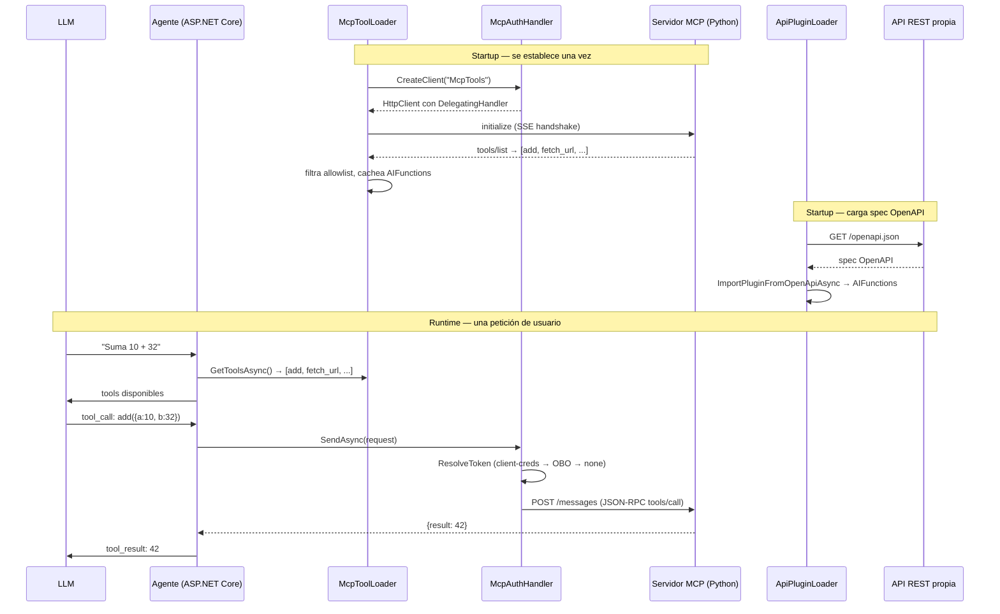

# Lab 4 — Cliente C# con ModelContextProtocol.Client

**Duración**: 25 min  
**Objetivo**: Conectar desde .NET al servidor MCP del Lab 3. Entender cómo nuestra plataforma MAF implementa esta conexión en producción, y conocer el camino alternativo vía OpenAPI.

---

## Prerrequisitos

- .NET 10 SDK instalado
- Servidor Python del Lab 3 arrancado (`python server.py` en `sample-server/`)
- NuGet `ModelContextProtocol` disponible (se instala en los pasos)

---

## Intro — Dos caminos para dar tools a un agente

En MAF un agente puede obtener tools de dos fuentes:

| Camino | Mecanismo | NuGet / librería | Cuándo usarlo |
|---|---|---|---|
| **MCP** | Protocolo JSON-RPC 2.0 sobre SSE | `ModelContextProtocol` | El servidor expone el protocolo MCP (Lab 3, servidores de terceros) |
| **OpenAPI plugin** | Spec OpenAPI → `KernelFunction` | `Microsoft.SemanticKernel.Plugins.OpenApi` | Tus propias APIs REST ya existentes (sin servidor MCP) |

En este lab cubrimos los dos. El código de referencia es real: está en producción en `maf-agent-template`.

---

## Paso 1 — Mini-demo: conectar desde C# al servidor del Lab 3

Crea un proyecto de consola .NET 10:

```bash
dotnet new console -n McpDemo
cd McpDemo
dotnet add package ModelContextProtocol
```

Reemplaza `Program.cs`:

```csharp
using System.Net.Http;
using ModelContextProtocol.Client;

// 1. HttpClient apuntando al servidor SSE del Lab 3
var httpClient = new HttpClient { BaseAddress = new Uri("http://localhost:8000") };
var transport = new HttpClientTransport(
    new HttpClientTransportOptions { Endpoint = new Uri("http://localhost:8000/sse") },
    httpClient);

// 2. Sesión MCP (realiza el handshake initialize)
await using var client = await McpClient.CreateAsync(transport);

// 3. Listar tools disponibles
var tools = await client.ListToolsAsync();
Console.WriteLine("Tools disponibles:");
foreach (var tool in tools)
    Console.WriteLine($"  - {tool.Name}: {tool.Description}");

// 4. Llamar a una tool
var result = await client.CallToolAsync("add", new { a = 10, b = 32 });
Console.WriteLine($"\nResultado add(10, 32) = {result.Content[0].Text}");
```

```bash
dotnet run
```

Deberías ver la lista de tools y el resultado `42`.

> [!NOTE]
> `HttpClientTransport` es el transporte correcto para HTTP+SSE. La clase `SseClientTransport` también existe pero no permite inyectar un `HttpClient` configurado (ni handlers de auth). MAF siempre usa `HttpClientTransport`.

---

## Paso 2 — `McpToolLoader.cs` desgranado

En MAF, `McpToolLoader` envuelve todo lo anterior en un **singleton con caché** para no repetir el handshake en cada petición al agente.

```csharp
// Alias para evitar ambigüedad con otros "McpClient" del ecosistema
using McpRemoteClient = ModelContextProtocol.Client.McpClient;

public sealed class McpToolLoader : IAsyncDisposable
{
    private IReadOnlyList<AIFunction>? _cachedFunctions;   // caché en memoria
    private McpRemoteClient? _mcpClient;                   // sesión SSE viva
    private readonly SemaphoreSlim _initLock = new(1, 1); // doble comprobación thread-safe
```

**Por qué double-check locking:**  
El DI container registra `McpToolLoader` como Singleton, pero `GetToolsAsync` puede ser llamado concurrentemente por varios requests. Sin el semáforo, dos threads podrían conectar al servidor a la vez.

```csharp
public async Task<IReadOnlyList<AIFunction>> GetToolsAsync(CancellationToken ct = default)
{
    if (_cachedFunctions is not null) return _cachedFunctions; // fast path (sin lock)

    await _initLock.WaitAsync(ct);
    try
    {
        if (_cachedFunctions is not null) return _cachedFunctions; // segunda comprobación
        _cachedFunctions = await LoadToolsCoreAsync(ct);
        return _cachedFunctions;
    }
    finally { _initLock.Release(); }
}
```

**`HttpClientFactory` en lugar de `new HttpClient()`:**  
El nombre `"McpTools"` lo registra el DI container junto con `McpAuthHandler` como `DelegatingHandler`. De esta forma el loader nunca gestiona el ciclo de vida del cliente HTTP.

```csharp
var httpClient = _httpClientFactory.CreateClient("McpTools"); // incluye McpAuthHandler
var transport  = new HttpClientTransport(
    new HttpClientTransportOptions { Endpoint = new Uri(mcpConfig.SseEndpoint) },
    httpClient);
_mcpClient = await McpRemoteClient.CreateAsync(transport, ...);
```

**Allowlist (`Mcp:Tools` en appsettings):**

```csharp
var allowedTools = mcpConfig.Tools?.Keys.ToHashSet(StringComparer.OrdinalIgnoreCase) ?? [];

var filteredTools = (allowedTools.Count == 0
        ? allTools                                             // lista vacía = permitir todo
        : allTools.Where(t => allowedTools.Contains(t.Name)))
    .ToList<AIFunction>();
```

Si el servidor expone 20 tools pero solo declaras 3 en config, el agente solo ve 3. Útil para no exponer operaciones destructivas por error.

**`McpClientTool` es un `AIFunction`:**  
La interfaz `AIFunction` (de `Microsoft.Extensions.AI`) es el contrato común que entienden tanto Azure AI Agents como Semantic Kernel. `McpClientTool` ya la implementa — no hace falta ningún adaptador.

**`IAsyncDisposable`:**  
La sesión SSE es una conexión HTTP larga que vive mientras el singleton vive. Al apagar la aplicación, el runtime llama a `DisposeAsync` que cierra la sesión limpiamente:

```csharp
public async ValueTask DisposeAsync()
{
    if (_mcpClient is not null)
        await _mcpClient.DisposeAsync();
}
```

---

## Paso 3 — `McpAuthHandler.cs` desgranado

`McpAuthHandler` es un `DelegatingHandler` — middleware del pipeline HTTP que se ejecuta **antes** de que el request llegue al servidor MCP.

```csharp
public sealed class McpAuthHandler : DelegatingHandler
{
    protected override async Task<HttpResponseMessage> SendAsync(
        HttpRequestMessage request, CancellationToken ct)
    {
        // 1. Inyectar Bearer token (si no viene ya en el request)
        if (request.Headers.Authorization is null)
        {
            var token = await ResolveTokenAsync(ct);
            if (!string.IsNullOrEmpty(token))
                request.Headers.Authorization =
                    new AuthenticationHeaderValue("Bearer", token);
        }

        // 2. Inyectar clave de suscripción APIM (si está configurada)
        if (!string.IsNullOrWhiteSpace(_configuration.SubscriptionKey))
            request.Headers.Add("Ocp-Apim-Subscription-Key", _configuration.SubscriptionKey);

        return await base.SendAsync(request, ct); // pasar al siguiente handler
    }
```

**Cadena de resolución del token:**

```
Identity:Mcp configurado?
    SÍ  → client-credentials token  (servicio → servicio, sin usuario)
    NO  →  ¿hay HTTP context activo?
               SÍ  → OBO: forward del JWT del usuario
               NO  → sin token (startup / background jobs)
```

```csharp
private async Task<string?> ResolveTokenAsync(CancellationToken ct)
{
    // 1. Client-credentials
    if (!string.IsNullOrWhiteSpace(_identityConfig.Mcp.Authority) &&
        !string.IsNullOrWhiteSpace(_identityConfig.Mcp.ClientId))
    {
        try { return await _tokenService.GetAccessTokenAsync(ct); }
        catch { /* log + fallthrough */ }
    }

    // 2. OBO — forward del JWT del usuario actual
    try
    {
        var userToken = _userContext.JwtToken;
        if (!string.IsNullOrEmpty(userToken)) return userToken;
    }
    catch (InvalidOperationException) { /* no hay HTTP context */ }

    // 3. Sin token
    return null;
}
```

> [!NOTE]
> La conexión SSE inicial se establece en startup (cuando el Singleton se inicializa por primera vez). En ese momento puede que no haya contexto de usuario, de ahí el caso 3. Una vez la sesión SSE está viva, las llamadas posteriores sí tienen contexto y pueden usar OBO.

---

## Paso 4 — `McpConfiguration` — propiedades y ejemplos

```json
// appsettings.json (valores no sensibles)
{
  "Mcp": {
    "SseEndpoint": "https://my-mcp-server.azurewebsites.net/sse",
    "TimeoutSeconds": 30,
    "MaxRetryAttempts": 3,
    "Tools": {
      "add": "Suma dos números",
      "fetch_url": "Descarga el contenido de una URL"
    }
  }
}
```

```json
// user secrets / Key Vault (valores sensibles)
{
  "Mcp:SubscriptionKey": "abc123"
}
```

| Propiedad | Descripción | Sensible |
|---|---|---|
| `SseEndpoint` | URL del endpoint SSE del servidor MCP | No |
| `SubscriptionKey` | Clave APIM (`Ocp-Apim-Subscription-Key`) | **Sí** |
| `SubscriptionKeyVaultName` | Nombre del secreto en Key Vault | No |
| `TimeoutSeconds` | Timeout HTTP en segundos (default: 30) | No |
| `MaxRetryAttempts` | Reintentos ante error (default: 3) | No |
| `Tools` | Allowlist: nombre → descripción. Vacío = permitir todo | No |

---

## Paso 5 — Camino alternativo: OpenAPI como herramienta

Si ya tienes una API REST y no quieres montar un servidor MCP, puedes exponerla al agente directamente a partir de su spec OpenAPI. MAF lo hace con `ApiPluginLoader`.

**La idea:**

```
OpenAPI spec  →  Semantic Kernel ImportPluginFromOpenApiAsync  →  KernelFunction / AIFunction
```

Cada operación del spec se convierte en una tool que el LLM puede invocar igual que si viniera de MCP.

**Dos fuentes de spec (igual que el allowlist de MCP):**

```csharp
if (!string.IsNullOrWhiteSpace(config.OpenApiDefinitionUrl))
{
    // Fuente live: descarga la spec desde un endpoint APIM management
    var response = await managementClient.GetAsync(config.OpenApiDefinitionUrl, ct);
    specStream = await response.Content.ReadAsStreamAsync(ct);
}
else
{
    // Fuente embebida: fichero sample-openapi.json compilado en el assembly
    specStream = assembly.GetManifestResourceStream(
        "AgentName.Infrastructure.ApiPlugin.Specs.sample-openapi.json");
}
```

**Carga en Semantic Kernel:**

```csharp
#pragma warning disable SKEXP0040  // API experimental de SK
var plugin = await kernel.ImportPluginFromOpenApiAsync(
    pluginName: "ApiPlugin",
    stream: specStream,
    executionParameters: new OpenApiFunctionExecutionParameters
    {
        HttpClient = httpClient,        // HttpClient con ApiPluginAuthHandler
        ServerUrlOverride = new Uri(config.BaseUrl),
        EnablePayloadNamespacing = false
    });
#pragma warning restore SKEXP0040

// Convertir KernelFunction → AIFunction para el pipeline estándar
var functions = plugin
    .Select(f => f.WithKernel(kernel))
    .Cast<AIFunction>()
    .ToList();
```

**`sample-openapi.json` — la spec de ejemplo:**

El fichero embebido es un placeholder que describe tus endpoints. Sustitúyelo por el OpenAPI de tu API real. MAF lo incluye para que el proyecto arranque sin configuración adicional:

```json
{
  "openapi": "3.0.1",
  "info": { "title": "AgentName ApiPlugin", "version": "v1" },
  "paths": {
    "/api/sample": {
      "post": {
        "operationId": "Sample",
        "summary": "Sample operation — replace with your real endpoint",
        ...
      }
    }
  }
}
```

**Configuración `ApiPlugin`:**

```json
{
  "ApiPlugin": {
    "BaseUrl": "https://my-api.azurewebsites.net",
    "OpenApiDefinitionUrl": "https://apim.azure-api.net/my-api/openapi/json",
    "SubscriptionKey": "",
    "Plugins": {
      "Sample": "Operación de ejemplo"
    }
  }
}
```

---

## Paso 6 — Diagrama: flujo completo en MAF



---

## Reflexión

> [!NOTE]
> Dedica unos minutos a las preguntas antes de ver las respuestas.

**1. ¿Por qué `McpToolLoader` mantiene la sesión SSE viva en lugar de reconectar en cada llamada?**

<details>
<summary>Ver respuesta</summary>

El protocolo MCP requiere que el cliente y el servidor mantengan el estado de la sesión (se negocia en `initialize`). Si reconectamos en cada llamada, pagamos el coste del handshake y perdemos cualquier estado de sesión que el servidor mantuviera. Además, SSE es una conexión HTTP persistente — crearla repetidamente sería ineficiente.

</details>

**2. ¿Qué ocurre si `Mcp:Tools` está vacío en appsettings?**

<details>
<summary>Ver respuesta</summary>

El código interpreta una lista vacía como "sin restricción": `allowedTools.Count == 0` devuelve `true` y se exponen todas las tools que declare el servidor MCP. Útil en desarrollo; en producción es mejor declarar explícitamente las tools permitidas.

</details>

**3. ¿En qué situación usarías el camino OpenAPI en lugar del camino MCP?**

<details>
<summary>Ver respuesta</summary>

Cuando ya tienes una API REST documentada con OpenAPI y no quieres (o no puedes) añadir un servidor MCP. Por ejemplo: exponer los endpoints de tu microservicio de facturación al agente sin tocar su código. El camino MCP tiene más sentido cuando el servidor es externo o de terceros, o cuando quieres aprovechar las primitivas Resources y Prompts del protocolo.

</details>

---

**Siguiente**: [Lab 5 — Azure AI Agents + Semantic Kernel](../05-agent-integration/README.md)

---

## Prerrequisitos

- .NET 10 SDK instalado
- Servidor Python del Lab 3 corriendo en `http://localhost:8000/sse`

---

## Contexto MAF

En `maf-agent-template`, el fichero `Infrastructure/Mcp/McpToolLoader.cs` hace exactamente esto:

1. Crea un `McpClient` conectado via SSE al servidor MCP configurado
2. Lista las tools disponibles con `ListToolsAsync()`
3. Envuelve cada tool con `PermissionGuardedAIFunction` para control de acceso
4. Las registra en el agente para que el LLM pueda invocarlas

Este lab replica ese patrón a escala mínima.

---

## Pasos

### 1. Crear el proyecto .NET

```bash
mkdir -p sample-client/src
cd sample-client/src
dotnet new console -n SampleMcpClient
cd SampleMcpClient
dotnet add package ModelContextProtocol
```

### 2. Conectar al servidor MCP via SSE

Reemplaza el contenido de `Program.cs`:

```csharp
using ModelContextProtocol.Client;
using ModelContextProtocol.Protocol.Transport;

Console.WriteLine("Connecting to MCP server...");

var client = await McpClientFactory.CreateAsync(
    new SseClientTransport(new SseClientTransportOptions
    {
        Endpoint = new Uri("http://localhost:8000/sse")
    }));

Console.WriteLine("Connected.");

// Listar tools disponibles
Console.WriteLine("\nAvailable tools:");
var tools = await client.ListToolsAsync();
foreach (var tool in tools)
{
    Console.WriteLine($"  - {tool.Name}: {tool.Description}");
}
```

### 3. Llamar a una tool

Añade al final de `Program.cs`:

```csharp
// Llamar a la tool "echo"
Console.WriteLine("\nCalling 'echo' tool...");
var result = await client.CallToolAsync(
    "echo",
    new Dictionary<string, object?> { ["message"] = "Hello from C#!" });

Console.WriteLine($"Result: {result.Content[0].Text}");
```

### 4. Ejecutar

Asegúrate de que el servidor Python está corriendo, luego:

```bash
dotnet run
```

Deberías ver las tools listadas y el resultado de la llamada a `echo`.

### 5. Llamar a `process_text` (opcional)

```csharp
var textResult = await client.CallToolAsync(
    "process_text",
    new Dictionary<string, object?>
    {
        ["text"] = "model context protocol is an open standard for connecting llms to tools",
        ["max_words"] = 5
    });

Console.WriteLine($"Processed: {textResult.Content[0].Text}");
```

---

## Bonus: Azure Function como servidor MCP

Un Azure Function (HTTP trigger) puede actuar como servidor MCP si:

1. Implementa los endpoints MCP (`/sse`, handling de `initialize`, `tools/list`, `tools/call`)
2. Usa el SDK MCP para .NET en modo servidor

Esto permite exponer capacidades de negocio como tools MCP sin levantar un servicio adicional. Ver la documentación de `ModelContextProtocol.AspNetCore` para más detalles.

---

## Preguntas de reflexión

1. ¿Qué diferencia hay entre `McpClientFactory.CreateAsync` con `SseClientTransport` vs `StdioClientTransport`?
2. ¿Cómo añadirías un header de autenticación Bearer a la conexión SSE?
3. En MAF, ¿qué hace `PermissionGuardedAIFunction` con las tools que carga McpToolLoader?

---

## Siguiente paso

[Lab 5 — Azure AI Agents + Semantic Kernel](../05-agent-integration/README.md)
