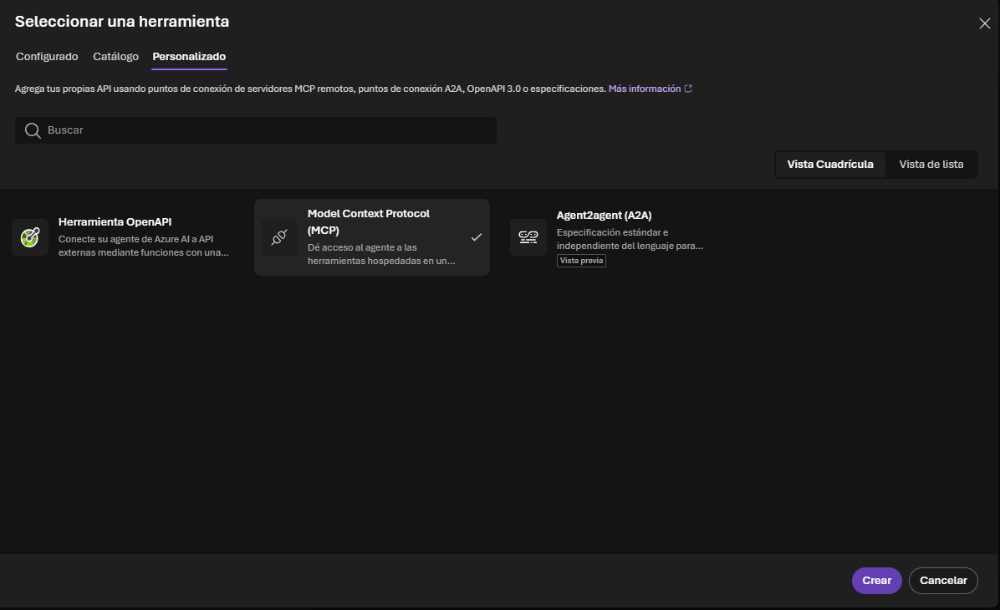
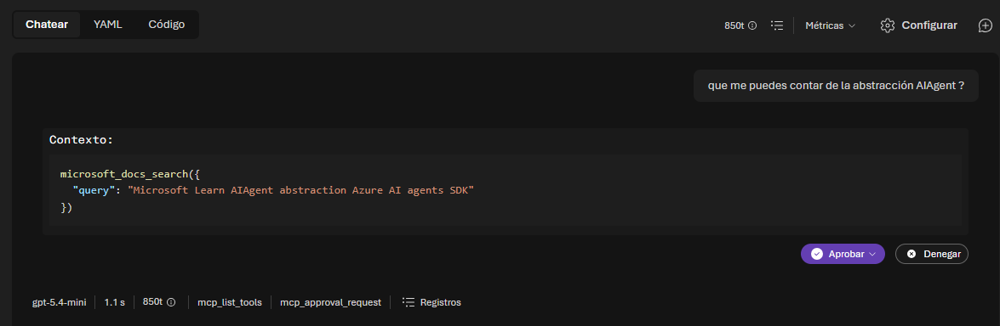
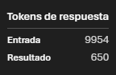

# Lab 5 — Azure AI Foundry Agents

**Duración**: 30 min  
**Objetivo**: Entender los dos roles que puede jugar Azure AI Foundry en una arquitectura de agentes, crear un agente gestionado en el portal y consumirlo desde C# con el SDK `Azure.AI.Projects`.

---

## Prerrequisitos

- Lab 4 completado (agente MAF funcionando con MCP y ApiPlugin)
- Acceso a un proyecto Azure AI Foundry
- `az login` realizado con una cuenta con acceso al proyecto

---

## Contexto

En el Lab 4 construiste un agente usando la plantilla MAF: `ChatClientAgent` corriendo en tu proceso C#, con `McpToolLoader` cargando tools vía SSE y `ApiPluginLoader` leyendo specs OpenAPI. El LLM era una llamada a un deployment de Azure OpenAI o AI Foundry.

Azure AI Foundry puede jugar dos roles distintos en tu arquitectura:

**Rol A — Proveedor de LLM** (= lo que ya haces en Lab 4)  
Despliegas un modelo en AI Foundry y apuntas `Llm:Endpoint` a esa URL. La orquestación, las tools, el system prompt — todo sigue en tu código C#. No cambia nada más.

**Rol B — Azure AI Agent Service** (= lo que explora este lab)  
El agente existe como recurso gestionado en el portal: tiene su propio system prompt y sus propias tool connections. Tu código C# solo crea threads y envía mensajes; Azure ejecuta el bucle de tool calls.

---

## Comparativa: local vs managed

| | Local (MAF — Lab 4) | Managed (AI Foundry Agent Service) |
|---|---|---|
| **Orquestación** | En tu C# (`ChatClientAgent`) | En Azure (portal) |
| **System prompt** | `SystemPrompt.md` como recurso embebido | Configurado en la UI del portal |
| **Tools** | `McpToolLoader` + `ApiPluginLoader` en código | Configuradas en el portal (MCP, code interpreter...) |
| **Historial de conversación** | `InMemoryChatHistoryProvider` (in-process) | Threads en Azure (persisten) |
| **SDK C#** | `Microsoft.Agents.AI` + `ModelContextProtocol.Client` | `Azure.AI.Projects` |
| **Control sobre la lógica** | Total | Delegado a Azure |
| **Cuándo usarlo** | Integraciones privadas, lógica compleja, pruebas | MVP rápido, gestión centralizada, historial persistente |

---

## Paso 1 — Crear el agente en el portal AI Foundry

1. Accede a [https://ai.azure.com](https://ai.azure.com) → tu proyecto → **Agents** → **New agent**
2. Asigna un nombre: `AgenteFormacionMcp`
3. En **System prompt**, escribe algo equivalente al `SystemPrompt.md` del Lab 4:

   ```
   Eres un asistente técnico especializado en formación de developers.
   Responde siempre en el idioma del usuario.
   Usa las herramientas disponibles cuando necesites información actualizada.
   ```

> [!NOTE]
> **System prompt en portal vs. `SystemPrompt.md` embebido (Lab 4)**
>
> En el Lab 4, el system prompt vive en `Prompts/SystemPrompt.md` como recurso embebido (`EmbeddedResource` en el `.csproj`). El `PromptBuilder` lo carga en tiempo de ejecución e inyecta tokens dinámicos como `{{USER_NAME}}` o `{{CURRENT_DATE}}` antes de enviarlo al LLM.
>
> | Aspecto | Portal (este lab) | `SystemPrompt.md` embebido (Lab 4) |
> |---|---|---|
> | Edición | UI del portal, sin deploy | Cambio de código + redeploy |
> | Control de versiones | Ninguno | Git — historial, PR, rollback |
> | Tokens dinámicos | No | Sí — `{{PLACEHOLDER}}` en tiempo de ejecución |
> | Por entorno (DEV/PRE/PRO) | Manual | Via config/User Secrets |
> | Testeable en CI | No | Sí — se puede cargar en tests unitarios |
>
> La UI del portal es más ágil durante el prototipado (cambios inmediatos, sin código). Para un agente en producción, `SystemPrompt.md` como recurso embebido ofrece las mismas garantías que cualquier otro artefacto de código.

4. En **Tools** → **Add** → pestaña **Personalizado** → **Model Context Protocol (MCP)**, pega la URL del Microsoft Learn MCP:

   ```
   https://learn.microsoft.com/api/mcp
   ```

> [!NOTE]
> La opción MCP **no aparece** en la pestaña "Configurado" (herramientas predefinidas de Azure). Debes ir a la pestaña **Personalizado**, que también permite añadir OpenAPI specs y conexiones Agent2Agent (A2A).

   

   Es el mismo servidor que usaste en el Lab 4 (Paso 4). Esta vez es Azure quien lo llama, no tu código C#.

5. Guarda el agente y anota su **Agent ID** (lo necesitarás en el Paso 2).

---

## Paso 2 — Secrets

Sobre el proyecto del Lab 4, añade las credenciales del agente:

```bash
dotnet user-secrets set "Foundry:Endpoint"  "https://<recurso>.services.ai.azure.com"
dotnet user-secrets set "Foundry:AgentId"   "<agent-id>"
```

La autenticación sigue el mismo patrón de la plantilla MAF:

```csharp
#if DEBUG
    TokenCredential credential = new DefaultAzureCredential();
#else
    TokenCredential credential = new ManagedIdentityCredential();
#endif
```

`az login` en local es suficiente para que `DefaultAzureCredential` funcione.

---

## Paso 3 — Consumir el agente desde C#

Añade el paquete:

```bash
dotnet add package Azure.AI.Projects
```

El patrón es thread-based: creas un thread (conversación), añades mensajes y ejecutas el agente:

```csharp
using Azure.AI.Projects;
using Azure.Identity;

var credential = new DefaultAzureCredential();
var client = new AIProjectClient(
    new Uri(configuration["Foundry:Endpoint"]!),
    credential);

var agents = client.GetAgentsClient();
var agentId = configuration["Foundry:AgentId"]!;

// Conversación
var thread = await agents.CreateThreadAsync();

await agents.CreateMessageAsync(
    thread.Id,
    MessageRole.User,
    "Dame una descripción de Agentic framework");

// Ejecutar y esperar
var run = await agents.CreateRunAsync(thread.Id, agentId);
do
{
    await Task.Delay(1000);
    run = await agents.GetRunAsync(thread.Id, run.Id);
}
while (run.Status == RunStatus.Queued || run.Status == RunStatus.InProgress);

// Leer respuesta
await foreach (var msg in agents.GetMessagesAsync(thread.Id))
{
    if (msg.Role == MessageRole.Agent)
    {
        foreach (var content in msg.ContentItems)
        {
            if (content is MessageTextContent textContent)
                Console.WriteLine(textContent.Text);
        }
        break;
    }
}
```

Otras preguntas que puedes hacer (el agente usará el Microsoft Learn MCP para responderlas):

- `"¿Qué diferencia hay entre un agente reactivo y uno planificador?"`
- `"Explícame el patrón ReAct (Reasoning + Acting) con un ejemplo"`

### Comportamiento en el playground vs en el SDK

Si pruebas el agente en la UI del portal antes de llamarlo desde código, verás que el playground pide aprobación antes de ejecutar el tool call:



Esto es una **guardia de seguridad exclusiva del portal** para que puedas revisar qué argumentos se pasan al MCP antes de ejecutarlo. Cuando llamas al agente desde el SDK, la tool se ejecuta automáticamente sin ningún paso de aprobación.

Los MCP tools son **server-side tools** — Azure los ejecuta desde su infraestructura, igual que Code Interpreter. El run pasa directamente de `InProgress` a `Completed`, sin `RequiresAction` (ese estado sólo aparece con function calling clásico, donde tu código debe devolver el resultado).

### Coste en tokens

Observa el desglose de tokens en el playground al hacer una pregunta:



La asimetría entrada/salida es normal en cualquier agente con RAG o tools. El grueso de los tokens de entrada viene del **contenido devuelto por el MCP** (fragmentos de documentación de Microsoft Learn), que se inyecta en el contexto para que el modelo sintetice la respuesta.

| Origen | Tokens aprox. |
|---|---|
| Contenido devuelto por `microsoft_docs_search` | ~7.000–8.000 |
| System prompt + historial + mensaje del usuario | ~500–1.000 |
| Schemas de tools + `mcp_list_tools` | ~400–600 |
| **Total entrada** | ~9.954 |
| **Respuesta generada** | 650 |

El patrón es el mismo en el Lab 4 con MAF local: cada llamada al MCP inyecta el mismo volumen de contexto. El coste real de un agente con herramientas es dominado por los input tokens, no los output.

---

## Paso 4 — Relación con `ChatClientAgent` del MAF

En el Lab 4, `ChatClientAgent` (de `Microsoft.Agents.AI`) es un wrapper sobre `IChatClient` que implementa el bucle de tool calls: llama al LLM, ejecuta las tools que el LLM pide, devuelve el resultado al LLM y repite hasta obtener una respuesta final.

`IChatClient` es la abstracción de `Microsoft.Extensions.AI` que puede apuntar a cualquier LLM (Azure OpenAI, Ollama, un Foundry deployment...).

**Por qué no se puede "enchufar" un agente de Foundry como `IChatClient`:**

El Azure AI Agent Service tiene su propia API (threads/runs), no implementa la interfaz `IChatClient`. Son dos modelos de ejecución distintos: uno es una función C# local, el otro es un servicio Azure con su propio bucle de orquestación.

Para usar un agente de Foundry necesitas `Azure.AI.Projects`, no `Microsoft.Extensions.AI`. Si quisieras que tu host MAF delegara en un Foundry Agent, tendrías que implementar un `IChatClient` personalizado que internamente usara `AgentsClient` — posible, pero tú asumes esa complejidad.

**Cuándo usar cada modelo:**

| Situación | Recomendación |
|---|---|
| Tools que acceden a recursos de red privada (VNet, BD interna) | MAF local — las tools corren en tu proceso |
| System prompt que varía por usuario o contexto | MAF local — `PromptBuilder` con tokens dinámicos |
| Historial que debe persistir entre reinicios de app | Foundry Agent Service — Threads en Azure |
| Iteración rápida sobre system prompt sin redespliegue | Foundry Agent Service — edición directa en portal |
| MVP sin infraestructura C# adicional | Foundry Agent Service |

---

## Preguntas de reflexión

> [!NOTE]
> Tómate un momento para reflexionar sobre lo que has visto en los 5 labs. Las respuestas están en los desplegables.

---

**1. En el modelo managed, ¿quién ejecuta las tool calls — tu código C# o Azure? ¿Qué implica eso para herramientas que acceden a recursos privados de la empresa?**

<details>
<summary>Mostrar respuesta</summary>

> Azure las ejecuta desde sus servidores. El servidor MCP debe ser accesible desde Azure — no puede ser `localhost`.

Si el servidor MCP accede a una base de datos interna, una VNet privada o un sistema interno sin exposición pública, necesitarías uno de estos enfoques: private endpoint en el servidor MCP, VNet integration en AI Foundry, o quedarte con el modelo local MAF donde las tools corren en tu proceso C# (que sí tiene acceso a la red interna).

El modelo local (Lab 4) no tiene este problema: `McpToolLoader` conecta al servidor MCP desde tu proceso, que ya tiene acceso a la infraestructura interna de la empresa.

</details>

---

**2. ¿Qué ventaja tiene almacenar el historial de conversación en un Thread de Azure frente al `InMemoryChatHistoryProvider` que usa la plantilla MAF?**

<details>
<summary>Mostrar respuesta</summary>

> Los Threads de Azure persisten aunque tu app se reinicie o escale horizontalmente — cualquier instancia puede retomar la conversación usando el threadId.

`InMemoryChatHistoryProvider` vive en el proceso: si se reinicia la app o una petición llega a otra instancia en un entorno con múltiples réplicas, el historial se pierde. Esto se puede solucionar en MAF usando un proveedor de historial externo (Redis, SQL...), pero implica más infraestructura.

Para muchos casos empresariales los agentes son stateless por diseño (cada request es una conversación nueva) y el historial en memoria es suficiente. Los Threads de Foundry son útiles cuando la conversación debe continuar a lo largo de sesiones.

</details>

---

**3. `DefaultAzureCredential` funciona localmente con `az login`. ¿Por qué no se debe usar en entornos desplegados?**

<details>
<summary>Mostrar respuesta</summary>

> `DefaultAzureCredential` prueba múltiples mecanismos de autenticación en orden (variables de entorno, Azure CLI, Visual Studio, MSI...). En producción puede engancharse a credenciales que no deberían estar disponibles, con comportamientos impredecibles según el entorno.

`ManagedIdentityCredential` es explícito: usa solo la identidad gestionada asignada al recurso Azure, sin dependencias de herramientas de desarrollo. Cuando el recurso no tiene identidad gestionada asignada, falla rápido con un error claro en lugar de probar silenciosamente otras rutas.

El patrón del MAF (`#if DEBUG ... DefaultAzureCredential ... #else ... ManagedIdentityCredential`) resuelve este problema: desarrollo cómodo localmente, comportamiento determinista en deploy.

</details>

---

**4. El agente del portal tiene un system prompt fijo editable en la UI. ¿Qué limitación supone esto frente al `PromptBuilder` + `SystemPrompt.md` del MAF?**

<details>
<summary>Mostrar respuesta</summary>

> El system prompt del portal es estático y manual: no se puede versionar como código, no admite tokens dinámicos y no hay historial de cambios automático.

El `PromptBuilder` del MAF carga `SystemPrompt.md` como recurso embebido y puede inyectar tokens en tiempo de ejecución (`{{USER_PLACEHOLDER}}`), lo que permite personalizar el prompt según el usuario, el rol o el contexto de cada request. El archivo se versiona junto al código en Git: los cambios al prompt pasan por PR, review y pipeline como cualquier otro cambio.

Para prompts que evolucionan rápido durante el prototipado, la UI del portal es más ágil. Para un agente en producción con lógica de prompt elaborada, el modelo de código es más robusto y auditable.

</details>

---

## Fin del workshop

Has completado los 5 labs. Revisa el [cheatsheet.md](../../cheatsheet.md) y [resources.md](../../../resources.md) para seguir aprendiendo.

